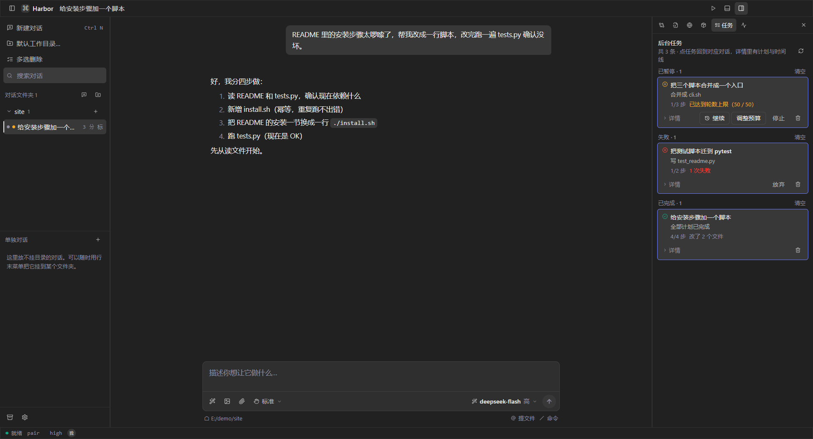
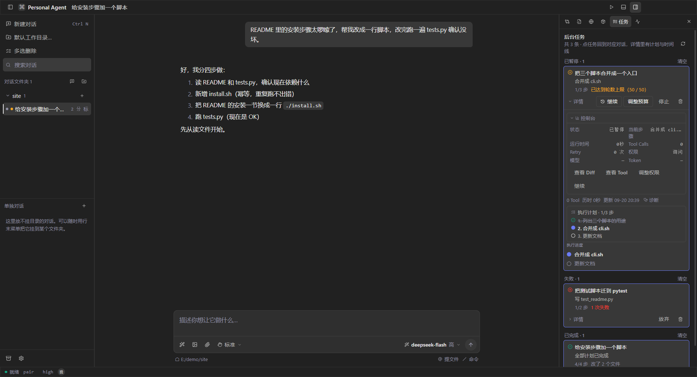

# Harbor

> ⚠️ **半成品（beta），别拿来干正事。** 还在逐步改进 —— 版本号带 `-beta.N` 标记。

这是一个跑在自己电脑上的 AI 助手。数据、密钥、对话全留在本机。

别的工具是「把代码贴进网页，等它回话」；Harbor 是「给它一个目录，让它在里面读文件、改文件、跑测试」。它干了什么你随时能看到，也能随时叫停。

<summary>主界面</summary>



<summary>任务中心与控制台</summary>



</details>

---

## 它能干什么

举个例子。你有个小项目，README 里的安装步骤早就过期了。

> **你**：读一下 README 和 tests.py，把安装步骤改成一行脚本，改完跑一遍测试确认没坏。
>
> **Harbor**：先列个四步计划——① 读这两个文件，确认依赖 ② 新增 `install.sh` ③ 改 README ④ 跑测试。然后一步步做。每一步做了什么、跑了什么命令、退出码多少，都记在任务台账里。改文件之前弹窗让你看 Diff（默认折叠）。测试没过它会自己说「没通过」，不糊弄。

它更像一个记性很好、干活有台账、你随时能插话的助手。决策还是在你手上。

适合你如果：不想把代码和密钥交给第三方；想知道 Agent 到底动了什么；会走开一会儿，回来接着做。

---

## 快速开始

目标：**5 分钟跑通第一个任务** —— 下载 → 填模型 → 说一句话 → 看着它干完。

### 1. 下载（Windows，不用装 Node）

1. 去 [Releases](../../releases) 下最新的压缩包（`harbor-x.y.z-win-x64.zip`）
2. 解压到一个你记得住的位置，双击 `Harbor.exe`
3. 数据存在 exe 同级的 `data/` 里。换电脑整目录拷走就行，删掉 `data/` 就等于清空全部状态

### 2. 从源码跑

需要 Node 22.19+（Windows 10/11）。

```bash
git clone <这个仓库>
cd Harbor
npm install
npm run dev        # 起 Vite + Electron（热更新）
npm run package    # 打便携版 → dist-portable/Harbor/
```

### 3. 填模型（第一次必须做，约 2 分钟）

设置（左下角齿轮，或 `Ctrl+,`）→ **模型** → 填三样：

- **Base URL**：任何 OpenAI 兼容接口，比如 `https://api.deepseek.com/v1`
- **API Key**：用界面填，会走系统凭证库（Windows DPAPI）加密后存本机
- **模型名**：填你账号能用的模型 id

仓库里没有任何内置密钥，也不代付。模型自备。`config.example.json` 里能看到完整配置结构，所有 `apiKey` 都是空的。密钥不会下发到界面层，也不会写进日志。

### 4. 跑通第一个任务（约 30 秒）

1. **新建对话**：左上角「新建对话」，或 `Ctrl+N`
2. **挑个工作目录**：点左下角状态栏那行路径（例如 `…\workspace（默认）`），换成你想让它动的目录
3. **说一句话**。要具体，比如：

   > 读一下这个目录里的 README 和测试脚本，把过期的安装步骤改成一行命令，改完跑一遍测试确认没坏

4. **你会看到四样东西**（这些就是「它在干什么」的全部）：
   - 对话区顶上的**任务横幅**：任务名 + 计划 N 步 + 当前步骤
   - 对话里的**工具调用**：读了哪个文件、跑了什么命令、退出码多少（默认折叠）
   - 写文件之前的 **Diff 确认弹窗**：默认折叠，看得到「改成什么样」再决定放不放
   - 右栏 **任务 / 审查**：台账（计划勾选、改动文件、检查点）与逐处改动对账，还能整批撤销

**第一次请拿一个真实但不要紧的小目录试**（某个仓库的副本就行），别直接对着重要项目开跑。

> 名词看不懂？先看 [`docs/核心概念.md`](docs/核心概念.md)（会话 / 任务 / 检查点 / 工具调用 / 权限，一页讲清）。

---

## 核心能力

- **有台账的任务**：每个任务记着计划与进度、每次工具调用、命令退出码、改动过哪些文件、检查点、恢复过几次
- **能中断、能接着做**：暂停 / 停止 / 恢复。重启应用后没做完的任务还在，能接着往下走
- **能中途改方向**：跑到一半直接打字「别用方案 A 了，改 B」，它接回同一条任务，不重做已完成的步骤
- **看得见改动**：写文件前弹窗预览 Diff（默认折叠）。改完在右栏「审查」里对账，顶栏有 `+N −M`
- **预算与刹车**：轮数 / 工具次数 / 时长 / 重试 / token 五项上限。撞上就停下来问你，不是失败
- **转圈检测**：认得出 A→B→A→B 的重复执行。先改道，几次不听才交给你
- **可观察性**：每轮性能时间线（首反馈 / 首字 / 整轮 / 上下文 / 模型 / 工具），一键生成任务诊断报告

---

## 权限模型

Agent 能碰的东西是分级的，默认最保守：

| 范围 | 默认 | 说明 |
| --- | --- | --- |
| 工具权限 | 需要确认 | 写文件、改文件、跑命令都会弹窗问你。另有「只读」与「完全访问」两档 |
| 文件范围 | 仅工作目录 | 要动目录外的文件会单独问你一次，批准后本次会话有效 |
| 命令风险 | 四档 | 低风险直接跑；装依赖/构建/改 git 状态会问；递归删除/提权会问；格式化磁盘、抓凭据这类即使设成「直接执行」也会拦 |
| 删除文件 | 需要更高授权 | 而且会进改动事务，能整批回滚 |
| MCP | 默认关闭 | 你手动加的服务器才会启动。子进程只拿白名单环境变量 |
| Memory | 先问我 | 模型想记东西时会问你。也可以设成「自己记」或「只读不写」 |

---

## Shell 与终端

**跑命令**走上面那套风险分级，超时默认 60 秒，可取消。每次调用的参数、输出、退出码都进审计日志。

**终端**（`Ctrl+J` → 终端）是真的 PTY（`node-pty`），vim / htop 能跑。它在你指定的工作目录里启动。

**停止**会尽量断干净——流、工具、命令、MCP 子进程。应用退出后不留孤儿进程。

---

## MCP（外部工具协议）

MCP 是让 Agent 接第三方工具的标准协议（GitHub、数据库、浏览器自动化之类）。设置 → 扩展 里可以加服务器，命令形如：

```
npx -y @modelcontextprotocol/server-filesystem D:\data
```

不想记命令行就用内置预设。那个页面里有几张卡片（文件系统 / 网页抓取 / 知识图谱记忆 / Git），点一下就把命令填进表单，当前工作目录已经替你填好，路径带空格会自动加引号。

**用应用自带的 Node 跑**：Electron 自带一个 Node（可执行文件加 `ELECTRON_RUN_AS_NODE=1` 就是 node），所以你自己写的 JS 服务器不用先装 Node，指一个 `.js` 文件就行。但走 `npx -y @modelcontextprotocol/server-*` 的那几个官方服务器仍然需要你装了 Node——`npx` 是 npm 的东西，Electron 只带 Node、不带 npm。预设卡片上标了哪条是哪种。

安全上刻意做了隔离：MCP 服务器是不可信的外部程序，所以子进程默认只拿到白名单里的环境变量（PATH / SystemRoot / TEMP 这类「不给就跑不起来」的），不会继承你的全部环境变量。即使你显式打开「继承环境」，密钥类变量也会被过滤掉。

服务器提供的工具会和内置工具一起给模型用。每个工具的调用都进审计日志。

---

## 记忆

模型觉得某件事值得记住时（比如「这个项目用 pnpm 不用 npm」），默认会先问你。记下来的内容存在本机，之后按相关性注入每轮对话。你可以在设置 → 记忆里逐条查看、编辑、删除。

「记错一条比改错一个文件影响更久」，所以默认不是自动写。

---

## 你的数据在哪

```
<应用目录>/data/
├── config.json          设置
├── credentials.json     模型密钥（系统凭证库加密，明文只在本机内存里）
├── sessions/            对话记录
├── tasks/               任务台账（计划、工具调用、改动文件、检查点）
├── memory.json          长期记忆
├── changesets/          改动快照（用于 Diff 与回滚）
├── audit/               工具审计日志（参数已脱敏）
└── logs/                运行日志
```

除模型接口外没有任何网络请求。没有遥测、没有账号、没有云同步。

更新与备份、数据迁移与回退：见 [`docs/更新与数据迁移.md`](docs/更新与数据迁移.md)。

---

## 安全注意事项

- **密钥**：用界面填，走系统凭证库。不要手写进 `config.json`
- **日志与诊断**：贴到公开 Issue 前先脱敏。应用自带的诊断包已做 redact 处理（API Key / Token / Authorization / 私钥替换成占位符），但你自己的工作目录路径还在，介意的话手动替换
- **报漏洞**：走 [`SECURITY.md`](SECURITY.md) 的私密渠道，别开公开 Issue
- **完整的安全设计与已知问题**：[`SECURITY.md`](SECURITY.md)

---

## 开发

```bash
npm test               # 内核自检（不联网、不需要 Electron；项数每版都会涨，看 CI 输出）
npm run test:unit      # 前端单元测试
npm run test:app       # 无窗口跑一遍，打印主进程与渲染层的真实状态
npm run pty:check      # 验 node-pty（纯 Node 与 Electron ABI 都要过）

npx tsc --noEmit                                   # 类型（零容忍）
npx eslint src --ext .ts,.tsx                      # 风格
npx prettier --check "src/**/*.{ts,tsx}"           # 格式
```

这套测试不是摆设。只有实际跑起来才会暴露、单测照不到的 bug（字段名读错、状态没收尾、长任务看不到 token、干净环境里托盘起不来）都变成了新的断言。CI 在每次 push 时跑一遍（[`.github/workflows/ci.yml`](.github/workflows/ci.yml)）。

改代码前请读 [`CONTRIBUTING.md`](CONTRIBUTING.md)（含几条会被守门测试拦下的硬规矩）与 [`AGENT.md`](AGENT.md)。

---

## 任务类型矩阵

哪些任务能做、成熟到什么程度。标「实验性」就是别指望它，标「稳定」就是日常放心用。

| 任务类型 | 成熟度 | 说明 / 已知边界 |
| --- | --- | --- |
| 读文件 / 搜代码 / 答疑 | 稳定 | 最常用，边界最清晰 |
| 单文件修改 → 跑测试 → 汇报 | 稳定 | 主路径，工具集和提示词都围绕它设计 |
| 多文件改动（同一仓库） | 稳定 | 走改动事务，可整批回滚 |
| 长任务 / 中途改方向 / 断了接着做 | 稳定 | 任务台账 + 检查点 |
| 长期记忆 | 稳定 | 检索式注入（挑相关的，不是整篇塞）。项目级与全局分开 |
| 跑命令 / 装依赖 / 构建 | 可用 | 按风险分级确认。critical 一律拦 |
| 联网搜索 / 读网页 | 可用 | 返回值标注「这是数据不是指令」 |
| 用内置浏览器操作页面 | 可用 | 点击/填表单要确认。密码框单独确认 |
| 生成图片 | 可用 | 要花钱，所以归到写操作里，先让你看一眼 prompt |
| MCP 外部工具 | 可用 | 只实现 stdio。按不可信处理（环境白名单 + 返回值标注） |
| 本地插件 | 可用 | 自己放进 `data/plugins/`。支持热插拔 |
| 跨仓库操作 | 实验性 | 没有多项目隔离模型，别指望 |
| 数据库迁移 / 碰生产环境 | 实验性 | 风险分级会拦 critical，但别拿它碰生产 |
| 交互式命令（要你回话的） | 实验性 | 工具说明里明确写了「不要用它跑需要交互的命令」 |
| 全自动跑一整天没人看 | 不做 | 预算上限（轮数 / token / 时长）就是为这个装的 |
| 多人协作 / 云同步 / 手机端 | 不做 | 见下面「已知问题」 |

---

## 平台支持

| 平台 | 跑开发版 | 打包 / 托盘 / 安装 | 备注 |
| --- | --- | --- | --- |
| Windows 10/11 | ✅ | ✅ 完整验证过 | 主目标平台。密钥走 Windows DPAPI |
| macOS | ✅ 理论可以 | ❌ 没验过 | 打包、托盘、安装流程都没跑过 |
| Linux | ✅ 理论可以 | ❌ 没验过 | 无 keyring 时密钥退化为明文，界面会明确标出来 |

「能跑」= 用源码起得来。「没验过」= 我不为它背书。别把这行读成「支持 macOS」。

---

## 已知问题

- 只在 Windows 上完整验证过。macOS / Linux 能跑开发版，但打包、托盘、安装流程没验
- 界面只有中文
- 不支持多人协作、云同步、手机端。MCP 只实现 stdio 传输（本地服务器够用，远程 SSE 没做）
- 任务台账是 JSON 文件（一条一个），几千条以上没有做分页优化

---

## Roadmap

**打算做**：macOS / Linux 的打包验证（没有设备，暂时做不了）。

**不打算做**：变成云端服务。多人协作。把 Harbor 自己做成 MCP server 给别人调（想不出真实用途）。让 Agent 全自动跑一整天没人看（刹车就是为这个装的）。

---

## FAQ

**和 Claude Code / Cursor 有什么区别？**
它们是给「写代码」这一个场景做的。Harbor 更像通用工作台——有任务台账、能暂停恢复、能中途改方向，而且数据不出本机。

**为什么要自己填 API Key？**
因为不代付、不中转、不记录你的 key。你直接和模型厂商通信。

**它能自己跑一整天吗？**
技术上可以，但别这么干。预算上限就是为这个准备的（轮数 / token / 时长都会兜住）。而且项目不打算做「会自己跑一整天」的功能——这句是认真的。

**为什么只有一个中文界面？**
作者在用中文工作，先把功能做扎实。i18n 在 roadmap 的后面。

---

## 许可与协作方式

[MIT](LICENSE)。随便用，出事别找我。第三方素材与依赖的授权见 [`THIRD-PARTY.md`](THIRD-PARTY.md)。

这个项目是人和 AI 结对做的：人定方向、做验收、决定什么不做；AI 写代码、写文档、跑测试。每个功能都在 [`CHANGELOG.md`](CHANGELOG.md) 里记着「为什么这么改、哪里踩了坑」——包括改错又改回来的那几次。
