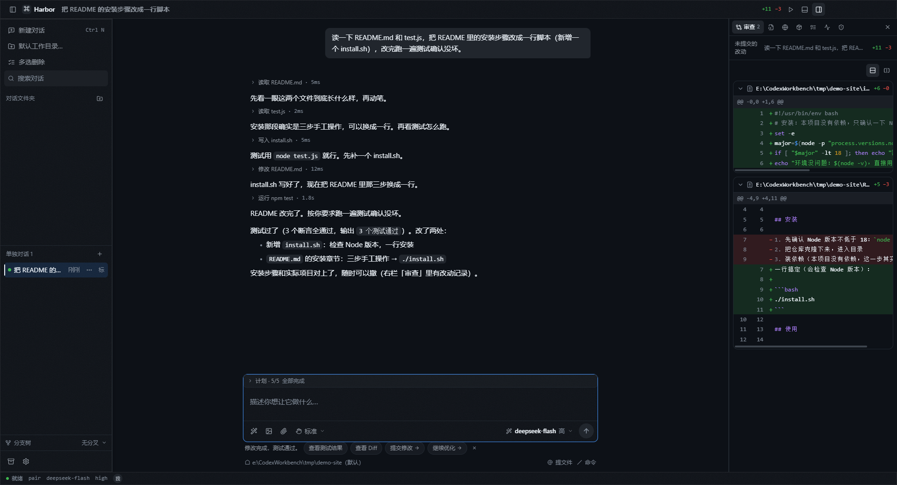
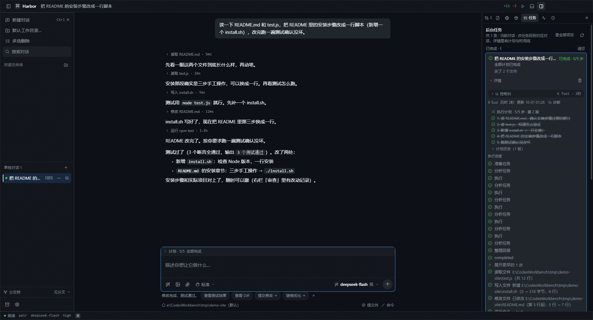

# Harbor

> ✅ **正式版** —— 功能和数据格式都稳定了，可以拿来干活。版本号只以 `package.json` 为准
> （README 故意不抄，抄了就会漂）；改了什么、为什么改，都记在 [`CHANGELOG.md`](CHANGELOG.md)。

这是一个跑在你自己电脑上的 AI 助手。数据、密钥、对话全留在本机。

别的 AI 工具，你得把代码复制粘贴到网页里，等它回复。Harbor 不一样：你告诉它一个文件夹，它就在里面自己动手——看文件、改文件、跑起来试试。它干了什么你随时能看到，也能随时叫停。



<details>
<summary>任务中心与控制台（点开看图）</summary>



</details>

---

## 它能帮你做什么

举个例子。你有个小项目，README 里的安装步骤早就过期了。

> **你**：读一下 README 和 tests.py，把安装步骤改成一行命令，改完跑一遍测试确认没坏。
>
> **Harbor**：它会先列一个计划，比如"第一步看这两个文件，第二步写一个安装脚本，第三步改 README，第四步跑测试"。然后一步一步做。每一步干了什么、跑了什么命令、结果怎么样，它都会记下来，你想看随时能翻。改文件之前会弹窗让你看改动前后的对比（默认折起来）。测试没过它会自己说「没通过」，不糊弄。

再举几个它擅长的：

- **摸清一个不熟的项目**：让它先读一遍，讲清楚这东西怎么跑起来、哪几个文件是关键
- **文档和代码对账**：让它把说明文档和代码逐条对一遍，列出「写着的」和「实际做的」不一样的地方
- **跑一遍再汇报**：让它把测试跑一遍，失败的整理成一段人话给你
- **收拾烂摊子**：一堆名字乱、彼此矛盾的说明文档，让它整理成一份清单给你过目

决策仍然在你手上。它不困，你困。

---

## 怎么开始用

目标：**5 分钟跑通第一个任务** —— 下载 → 填模型 → 说一句话 → 看着它干完。

### 1. 下载（Windows，不用装任何东西）

1. 去 [Releases](../../releases) 下最新的压缩包（`harbor-x.y.z-win-x64.zip`）
2. 解压到一个你记得住的位置，双击 `Harbor.exe`
3. 数据存在 exe 同级的 `data/` 里。换电脑整目录拷走就行，删掉 `data/` 就等于清空全部状态

### 2. 填模型（第一次必须做，约 2 分钟）

打开设置（左下角齿轮，或 `Ctrl+,`）→ **模型** → 填三样：

- **接口地址**：模型厂商给你的网址，比如 `https://api.deepseek.com/v1`
- **密钥**：模型厂商给你的密码，用来确认是你本人。用界面填，系统会帮你加密后存在本机
- **模型名**：你账号能用的那个名字，在厂商的文档里能查到

仓库里没有任何内置密钥，也不代付——模型费用你自己和厂商结算。`config.example.json` 里能看到完整配置长什么样，所有密钥那一项都是空的。密钥不会进日志，也不会发给界面。

### 3. 跑通第一个任务（约 30 秒）

1. **新建对话**：左上角「新建对话」，或 `Ctrl+N`
2. **挑个工作目录**：点左下角状态栏那行路径（例如 `…\workspace（默认）`），换成你想让它动的文件夹
3. **说一句话**。要具体，比如：

   > 读一下这个文件夹里的 README 和测试脚本，把过期的安装步骤改成一行命令，改完跑一遍测试确认没坏

4. **你会看到四样东西**（这些就是「它在干什么」的全部）：
   - 对话区顶上的**任务横幅**：这件事叫什么、计划几步、现在做到哪
   - 对话里的**它做的每一步操作**：读了哪个文件、跑了什么命令、成没成（默认折起来）
   - 写文件之前的**改动确认弹窗**：默认折起来，看得到「会改成什么样」再决定放不放
   - 右栏的**任务 / 审查**：它干的每件事都有记录（计划打勾、改过哪些文件、存档点），还能整批反悔

**第一次请拿一个真实但不要紧的文件夹试**（某个项目的副本就行），别直接对着重要项目开跑。

> 名词看不懂？先看 [`docs/核心概念.md`](docs/核心概念.md)（会话 / 任务 / 存档点 / 它做的操作 / 要不要问你，一页讲清）。

---

## 它跟别的 AI 工具有什么不一样

- **数据在你电脑上**：对话、密钥、它改过的东西，全在本机。没有账号，没有云端同步
- **它每一步你都看得见**：它干的每件事都有记录——计划、操作、命令的结果、动过哪些文件，随时能翻
- **它能中途停、能改方向、能反悔**：跑到一半直接打字「别用方案 A 了，改 B」，它接着做，不重做已经做完的；写文件前给你看改动前后的对比；不满意可以把这次改动整批撤回去；它还会顺手存个档，能回到某一步重来。重启之后没做完的还在，能接着往下走；有些操作动过、但不知道成没成（比如命令刚发出去就崩了），它会单独标出来让你先看一眼现场，而不是默默重跑一遍
- **它动手之前会问你**：改文件、跑命令默认都要你点一下。你可以调松，也可以一直保持最保守
- **大动作先问「多大」**：递归整个目录、批量操作、跑到工作目录外、预计要跑很久——它会先拦下来问清范围和代价（这个可以在设置里关掉；它只管规模，不管危险度）
- **它认得出自己在绕圈**：同样的操作来回重复，它会先换个走法；几次还是原地打转，才停下来交给你
- **它记得住，前提是你让它记**：想让它记住「这个项目用哪个工具」，你说一声它就记下来。在设置 → 记忆里能逐条查看、改、删。记错一条比改错一个文件影响更久，所以默认不是自动写
- **花销有刹车**：轮数、操作次数、时长、重试、token，五项都能设上限。撞上了它会停下来问你，不是直接失败

它不是魔法，只是比你打字快。

---

## 它能做 / 不能做的

「放心用」= 日常随便使。其他几档看一眼说明。

| 事情 | 到什么程度 | 说明 / 已知边界 |
| --- | --- | --- |
| 看文件、搜东西、回答问题 | 放心用 | 最常用，也最不容易出事 |
| 改一个文件 → 跑测试 → 汇报 | 放心用 | 主路径，其他功能都围着它转 |
| 同一个项目里改多个文件 | 放心用 | 走改动事务，能整批撤回去 |
| 长任务 / 中途改方向 / 断了接着做 | 放心用 | 靠记录和存档点 |
| 长期记忆 | 放心用 | 只挑相关的几条塞进去，不是整篇倒。项目和全局分开记 |
| 跑命令 / 装依赖 / 编译 | 能用 | 按危险程度分别问你。最危险的那类直接拦下 |
| 上网搜 / 读网页 | 能用 | 读到的东西会被标成「这是数据，不是给我的指令」 |
| 用内置浏览器点页面 | 能用 | 点按钮、填表单要你确认；密码框单独再问一次 |
| 生成图片 | 能用 | 要花钱，所以算「动手」这一类，先让你看一眼要画什么 |
| 接外部服务 | 能用 | 只支持本机起的服务；一律按「不可信的程序」对待 |
| 你自己写的本地小插件 | 能用 | 放进 `data/plugins/`，支持随时插拔 |
| 同时在好几个项目里干活 | 还在试，别指望 | 没有多项目隔离模型 |
| 数据库迁移 / 碰正式环境 | 还在试，别指望 | 危险命令会拦，但别拿它碰生产 |
| 需要你回话才能继续的命令 | 还在试，别指望 | 工具说明里写了「不要用它跑需要交互的命令」 |
| 没人看，自己跑一整天 | 这个它不做 | 别让它跑一晚上——预算上限就是为这个装的 |
| 多人一起用 / 手机上看 | 这个它不做 | 见下面「已知问题」 |

---

## 安全与隐私

**数据在哪**：全在应用目录下的 `data/` 文件夹里。

```
<应用目录>/data/
├── config.json          设置
├── credentials.json     模型密钥（系统凭证库加密，明文只在内存里出现）
├── sessions/            对话记录
├── tasks/               每件事的记录
├── changesets/          改动快照（用来给你看对比、用来反悔）
├── memory.json          它记住的事
├── skills/ plugins/     你加的技能与本地插件
├── audit/ errors/       操作日志（参数已打码）· 出错记录
├── logs/ backups/       运行日志 · 自动备份
└── （其余是缓存和运行态：chromium/ cache/ crash/ events/ workspace/ ……）
```

**密钥怎么存**：用界面填，交给系统自带的加密（Windows 上是 DPAPI）存在本机。不要手写进 `config.json`。日志、对话、操作记录落盘前都会先打码。

**会不会偷偷联网**：不会。除模型接口外没有任何网络请求——没有遥测，没有账号，没有云同步。

**它动手之前会不会问你**：

| 管什么 | 默认 | 大白话 |
| --- | --- | --- |
| 动不动手 | 需要确认 | 写文件、改文件、跑命令都弹窗问你。另有「只读」和「完全访问」两档可选 |
| 能动哪儿 | 只碰你指定的文件夹 | 要动别的文件夹会单独问你一次，答应后本次有效 |
| 命令多危险 | 分四档 | 安全的直接跑；装依赖、编译、改项目状态会问；递归删除、提权会问；**删到盘根、系统目录、家目录本身，或者要抓你的密码，直接拦下** |
| 删文件 | 要更高授权 | 而且会进改动事务，能整批撤回来 |
| 外部服务 | 默认不开 | 你手动加的才会启动，启动时只给它必需的环境变量 |
| 记东西 | 先问我 | 它想记之前会问你。也可以设成「自己记」或「只读不写」 |

跑之前看一眼改动，跑之后也看一眼。

想报漏洞走 [`SECURITY.md`](SECURITY.md) 的私密渠道，别开公开 Issue。完整的安全设计和「哪些没做」也在那份文件里。应用自带的诊断包已经做过打码（密钥、令牌、私钥都替换成占位符），但你自己的工作目录路径还在，贴出去之前介意的话手动替换。

哪个文件归谁管、谁指向谁，见 [`docs/数据模型.md`](docs/数据模型.md)；更新与备份、数据迁移与回退见 [`docs/更新与数据迁移.md`](docs/更新与数据迁移.md)。攒久了想看看有没有对不上的，跑 `npm run doctor`（只读，不动你的东西）。

---

## 未来愿景

现在它是一个助手：你交代一件事，它做完给你看。

想让它接得住更长、更散的事——你交代一件要好几天的活，它自己记着做到哪了，不用你每天重新说一遍上周那件事的进度。

能不能做成不知道，先朝这个方向走。

---

## 后续计划

### 确定要做

- **把 macOS 和 Linux 的打包、托盘、安装真跑一遍**。现在只有 Windows 完整验过，Mac 用户只能自己从源码起，等于半个门关着。手上没有这两台机器，所以一直摆着
- **给「它到底行不行」一个数字**。现在只有一个个的例子，没有成功率基线。拿一批真实任务跑出成功率、恢复率，才谈得上「改进了」
- **把「失败为什么失败」做成一份能读的报告**。现在能认出十来种失败类型、也能给出处置办法，但没有一份把「为什么」讲给人听的东西

### 在试

- **让它自己挑用哪个模型**。这个开关现在是关着的，我不确定它挑得比人准
- **跨项目的活**。现在只在单个项目里可靠，跨项目容易出现「A 项目改的东西以为在 B 项目」
- **让它自己决定「现在要不要做点什么」**。现在的时间是你自己在设置里定的，它不会自己判断
- **记忆自己归纳得更狠一点**。现在只做到「同一件事记过不止一次，就并成一句」，还很不聪明

### 明确不做

- **变成云端服务**。数据在你自己电脑上是这个项目的前提，搬上云这件事就没了
- **多人协作 / 云同步 / 手机端**。这要引入账号、权限、冲突合并一整套东西，和「数据全在你本机」是反的
- **把它自己做成一个给别人调用的服务**。想不出真实用途，做出来只是多一份要长期维护的接口
- **让它没人看着自己跑一整天**。预算刹车就是为这个装的：没人看的时候出了错，也没人接得住
- **给外部服务做内核级的网络强制**。现在只做到「策略 + 记录」，这是有意的选择，不装成已经做到了（见 [`SECURITY.md`](SECURITY.md) 的「没做什么」）

---

## 给开发者

从源码跑（需要 Node 22.19+，Windows 10/11）：

```bash
git clone <这个仓库>
cd Harbor
npm install
npm run dev        # 起 Vite + Electron（热更新）
npm run package    # 打便携版 → dist-portable/Harbor/
```

⚠ `npm run package` 第一步会按镜像名 `taskkill /F /IM Harbor.exe` —— 如果你的正式版 Harbor 正开着，会被它杀掉。打包前先关掉正在用的那个。

验证（这套测试不是摆设：字段名读错、状态没收尾、干净环境里托盘起不来这类问题，都是先跑起来才发现的）：

```bash
npm run verify         # 一站全跑：类型 → 风格 → 格式 → 行数红线 → 单测 → 内核自检 → 构建
npm run preflight      # verify + 应用自检，并打印「剩下必须人做的」
npm test               # 内核自检（不联网、不需要 Electron；项数每版都会涨，看输出）
npm run test:unit      # 前端单元测试
npm run test:app       # 无窗口跑一遍，打印主进程与渲染层的真实状态
npm run pty:check      # 验 node-pty（纯 Node 与 Electron ABI 都要过）

npm run doctor         # 数据体检（只读）：悬空引用 / 坏 JSON / 索引漂移
npm run stats          # 稳定性指标：成功率 / 恢复率 / 工具失败率
```

CI 在每次 push 时跑一遍（[`.github/workflows/ci.yml`](.github/workflows/ci.yml)）。
改代码前请读 [`CONTRIBUTING.md`](CONTRIBUTING.md) 与 [`AGENT.md`](AGENT.md)；
想找「某件事该读哪份文档」看 [`docs/README.md`](docs/README.md)，踩过的坑在 [`docs/踩坑记录.md`](docs/踩坑记录.md)。

### 终端

`Ctrl+J` → 终端，是一个真的命令行窗口（`node-pty`），vim / htop 这种全屏的命令行程序能跑。它在你的工作目录里启动。
它跑的每条命令都有超时（默认 60 秒，可以取消），每次调用的参数、输出、退出码都进操作日志。
停止会尽量断干净——输出流、正在跑的工具、命令、外部服务子进程都会收掉，应用退出后不留孤儿进程。

### 它自己怎么排错

- **每轮的性能时间线**：从你按下发送到第一个字出现、整轮跑完、上下文用了多少、模型花了多久、工具花了多久，都能看
- **一键生成诊断报告**：这一轮出问题时，导出一份可以直接贴出去的说明
- **数据体检**：`npm run doctor` 只读扫一遍数据（悬空引用 / 坏 JSON / 索引与磁盘对不上），`npm run stats` 给成功率、恢复率、工具失败率

### 接外部服务（MCP）

MCP 是让 Agent 接第三方工具的标准协议（GitHub、数据库、浏览器自动化之类）。设置 → 扩展 里可以加服务器，命令形如：

```
npx -y @modelcontextprotocol/server-filesystem D:\data
```

不想记命令行就用内置预设：那个页面有几张卡片（文件系统 / 网页抓取 / 知识图谱记忆 / Git），点一下就把命令填进表单，当前工作目录已经替你填好，路径带空格会自动加引号。

**用应用自带的 Node 跑**：Electron 自带一个 Node（可执行文件加 `ELECTRON_RUN_AS_NODE=1` 就是 node），所以你自己写的 JS 服务器不用先装 Node，指一个 `.js` 文件就行。但走 `npx -y @modelcontextprotocol/server-*` 的那几个官方服务器仍然需要你装了 Node——`npx` 是 npm 的东西，Electron 只带 Node、不带 npm。预设卡片上标了哪条是哪种。

安全上刻意做了隔离：外部服务是不可信的程序，所以子进程默认只拿到白名单里的环境变量（PATH / SystemRoot / TEMP 这类「不给就跑不起来」的），不会继承你的全部环境变量；即使你显式打开「继承环境」，密钥类变量也会被过滤掉。

服务器提供的工具会和内置工具一起给模型用，每次调用都进操作日志。

---

## 已知问题

- **只在 Windows 上完整验证过**。macOS / Linux 能跑开发版，但打包、托盘、安装流程没验过——别把这行读成「支持 macOS」。（Linux 上如果没有系统的密钥环，密钥只能退化成明文存着，界面会明确标出来）
- **界面只有中文**
- 不支持多人协作、云同步、手机端
- 外部服务只实现了本地（stdio）这一种连法，远程的没做
- 它干的每件事的记录是 JSON 文件（一条一个），几千条以上没做过翻页优化

## 常见问题

**和 Claude Code / Cursor 有什么区别？**
它们是给「写代码」这一个场景做的。Harbor 更像通用工作台——有记录、能暂停恢复、能中途改方向，而且数据不出本机。

**为什么密钥要我自己填？**
因为不代付、不中转、不记录你的密钥。你直接和模型厂商通信。

**它能自己跑一整天吗？**
技术上可以，但别这么干——预算上限就是为这个准备的。而且项目不打算做「会自己跑一整天」的功能，这句是认真的。

**为什么只有中文界面？**
作者在用中文工作，先把功能做扎实。

---

## 许可与协作方式

[MIT](LICENSE)。随便用，出事别找我。第三方素材与依赖的授权见 [`THIRD-PARTY.md`](THIRD-PARTY.md)。

这个项目是人和 AI 结对做的：人定方向、做验收、决定什么不做；AI 写代码、写文档、跑测试。每个功能都在 [`CHANGELOG.md`](CHANGELOG.md) 里记着「为什么这么改、哪里踩了坑」——包括改错又改回来的那几次。
