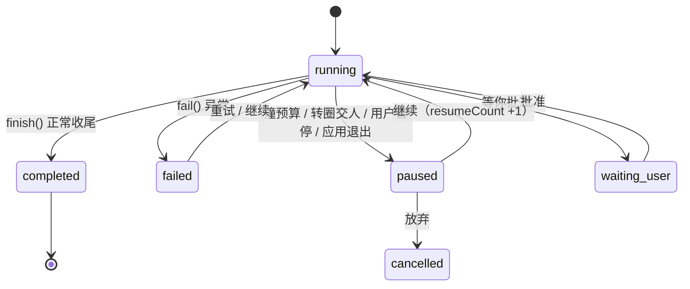

# Runtime 状态机

> 回答一个问题：**Agent 怎么开始、怎么停、怎么接着做、崩了算什么。**
>
> 数据形状看 [`数据模型.md`](数据模型.md)；名词解释看 [`核心概念.md`](核心概念.md)；
> 权限与安全边界看 [`安全模型.md`](安全模型.md)。
>
> ⚠️ 这份文档**只描述已经实现的东西**，不写「打算做成什么样」。

## 四层，别混

一次「你说一句 → 它做完停下」里其实套着四层状态。它们**各自独立**，
混在一起看就会出现「任务在跑但界面是暂停」这类误判：

| 层 | 是什么 | 状态住在哪 | 有几个状态 |
|---|---|---|---|
| **任务** | 一件活（可以跑很多次、可以恢复） | `data/tasks/<id>.json` 的 `status` | 6 |
| **一次执行** | 你在某条任务上按了一次「发送/继续」 | 内存 + 台账的 `resumeCount` / `pausedAt` | 见下 |
| **回合** | 调一次模型 | 内存（`loop.cjs` 的 `turn`） | — |
| **工具调用** | 读文件 / 跑命令 / 写文件… | 任务 `steps[]` 的 `intent` / `completed` | 4（含**结果不明**） |

界面上的**相位**（`idle / thinking / planning / executing / verifying / responding …`，
13 个）来自 `core/lifecycle.cjs` 的 `PHASES`，那是**给状态栏用的**，
和任务状态不是一回事 —— 别拿它当状态机。

## 任务状态（6 个）

```
running ──┬─→ completed      干完了
          ├─→ failed         出错了（错误原文在 task.errors[]）
          ├─→ cancelled      用户放弃
          ├─→ paused         停住了，**能接着做**（撞预算 / 转圈交人 / 按了暂停 / 关掉应用）
          └─→ waiting_user   在等你确认（权限弹窗那一类）
paused / waiting_user ──→ running   （点「继续」）
任意状态 ──→ cancelled              （任务中心放弃）
```



**`paused` 不是失败**，这是这套设计里最要紧的一条：它还带着 `nextAction`、
检查点、改动事务（未提交），点「继续」就从原地接着往下走。

### 谁会把状态改成 paused

| 触发 | `pauseReason` | 代码 |
|---|---|---|
| 撞任务预算（轮数 / 工具次数 / 时长 / token） | `budget` + `budgetHit` | `core/budget.cjs` |
| 转圈检测交给人（改道几次还不听） | `loop` + `loopHit` | `core/loop-run.cjs` |
| 你按了暂停 / 停止，或点了别的会话 | 空 | `core/loop-run.cjs`（AbortError 分支） |
| 应用退出（`will-quit`）或上次是被强杀的 | `interrupted` | `core/task.cjs` 的 `pauseRunning()` |
| 你可以自己在任务卡片上填预算 | — | 见 `docs/安全模型.md` 的预算一节 |

> `pauseRunning()` 有两个调用点：退出时、以及**启动时扫上一轮的遗留**。
> 强杀 / 崩溃退出时 `will-quit` 根本不跑，任务会一直卡在 `running` ——
> 那个「启动时扫一遍」就是为它准备的（真机上复现过：任务看得见、点不了继续）。

## 一次执行的收尾（四条路）

都在 `core/loop-run.cjs`，**一条都不许漏**：

1. **干完了** → `taskCore.finish(completed, result)`
2. **没干完但还能接** → `status: paused`（带 `budget` / `loop` 的原因和数字）
3. **被中断（AbortError）** → `paused`，事务**不提交**（还能整批撤）
4. **报错** → `taskCore.fail(...)` → `failed`，错误原文进 `task.errors[]`

## 工具调用：意图 → 执行 → 结果（含「结果不明」）

`core/task-intent.cjs` 定了一条铁律 —— **先落意图、再执行**（顺序颠倒就等于没记）：

```
markIntent()   执行之前：step 上写 intent{tool, commandHash, startedAt} + completed:false
   ↓ run()
markCompleted() 返回（或抛错）之后：写 completed:true / ok / outcome / summary
```

于是「进程在命令跑到一半时被强杀」在磁盘上只剩一个特征：**一条 `completed:false` 的意图**。
恢复器看到它必须明白：**这条命令动过、但结果不知道**。这时候：

- 不能当它没跑过直接重跑（可能已经产生了副作用）
- 也不能简单当 `failed`（它可能已经成功了）

所以状态是 **「结果不明」**（`isPending(step)`）。读老台账时要按「不可判定」处理 ——
老数据既没有 `intent` 也没有 `completed`，**不许当成「没跑过」**。

> ⚠️ 一次调用在 `steps[]` 里是**两条**记录（意图那条 + 带 `args` 的那条流水）。
> 统计、展示时二选一，别双计。

## 恢复

| 场景 | 怎么认出来 | 做了什么 |
|---|---|---|
| 应用正常退出 | `pauseRunning('exit')` | 在跑的任务标 `paused` / `interrupted` |
| 强杀、崩溃 | 启动时 `pauseRunning('startup')` | 同上（这是唯一能救回来的地方） |
| 你点了「继续」 | `core/task-resume.cjs` | `reopen()`，`resumeCount + 1`，`pauseReason` 清空 |
| 期间文件被别的东西改过 | `task.recovery` 的 `envChanged` | 启动时提示「其中 N 条要动的文件已经变过了」，**不依赖缓存** |
| 上一轮有结果不明的命令 | `task-intent.isPending()` | 恢复前先问人，不静默重跑 |

## 检查点恢复：怎么验（端到端）

**回归测试脚本**：`tmp/verify-checkpoint-e2e.cjs`

```bash
E:\nodejs\node.exe tmp/verify-checkpoint-e2e.cjs
```

它自己建一个**隔离副本**（`tmp/tok/verify`）+ 本地假模型（脚本化 SSE），跑一个真任务、真落盘、
真回退 —— 不花 token、不碰你自己的 `data/`。退出码恒为 0，**结论看输出**（13 项检查 + 发现清单）。

**先记住三条前提事实**，否则很容易把「边界」当成 bug：

1. **一个任务只有一个改动事务**（`data/changesets/<改动事务 id>/meta.json` 的 `taskId` 认得出来）——
   不是每个检查点一个事务。
2. **快照存的是「改前镜像」（pre-image）**，没有 post-image。文件名是序号（`0001.snap`），
   真名在 `meta.files[].snap` 里（**别按原文件名去找快照文件**，找不到）。
3. **检查点在「每轮改动完成」时记**（`tool-runner.cjs` / `loop-tools.cjs` 的「第 N 轮改动完成」、
   `loop.cjs` 的「第 N 轮结束」）；回退靠元组的 `at`（时间）认人，**不靠下标**。

**五个场景与期望**（`changesetRollbackTo(taskId, checkpointId)`）：

| 场景 | 期望 |
|---|---|
| 检查点之后**首次**被改的文件 | 进 `restored`，内容回到 pre-image |
| 检查点之后**新建**的文件 | 进 `removed`，磁盘上删掉 |
| **检查点之前**动过、之后又动的文件 | 进 `skipped` 并**写明原因**；**不碰它** |
| 重复撤同一处 | 幂等，仍然 `ok:true` |
| 某个快照文件丢了 | 整体仍然 `ok:true`；那个文件进 `failed` 并带 `reason`（不静默少文件） |

**干跑（`dryRun`）**：同上算法走一遍，但**一个字都不写盘**（不删文件、不写快照、**不标事务**）。
界面拿它做确认框里的「影响预览」——所以**预览说几个，真撤就是那几个**。

### 界面入口（AG-052，2026-10-01）

对话结束后下方、消息流末尾：`↺ 撤销检查点之后的改动`（`rollback/CheckpointRollbackBar.tsx`，
挂在 `MessageList.tsx` 末尾）→ 选检查点 → `askPermission` 二次确认（带影响预览）→ 真撤
→ 右栏「审查」顶部留一条记录（`rollback/RollbackRecord.tsx`，读 `useTaskStore.lastRollback`）。

只在**任务停了且有检查点**时出。以前这条能力**四处接口都有、`src/**` 零调用点**，用户点不到。

### 两条已知边界（都记在这儿，别再当新 bug 报一遍）

- **撤不动「先前改过、后来又改」的文件**。多轮改同一个文件时很常见：那一版内容磁盘上
  根本没存过（快照只有改前镜像），拿旧快照顶会把更早的改动一起撤掉，所以只能 `skipped` + 说明。
  要治得在检查点处**同时**存 post-image，代价是磁盘占用。
- **名字不许写成「回到检查点」**。它只能撤「这个点之后**才第一次**被改的文件」——
  界面、确认框、审查面板的记录都写全名「撤销检查点之后的改动」。改名从宽就是在骗用户。

### 真机怎么验（改这块界面时必跑）

```bash
E:\nodejs\node.exe tmp\verify-checkpoint-e2e.cjs   # 内核：13 项
E:\nodejs\node.exe tmp\verify-rollback-ui.cjs      # 界面：19 项（隔离副本 + 本地假模型，真点按钮）
```

## 开工前澄清的「离场」判定（AG-053）

巡查（`handlers/clarify-watch.cjs`，每 5 秒一跳）靠**注入的** `powerMonitor` 判人还在不在：
`getSystemIdleTime() ≥ clarifyIdleSeconds` 才算离场，卡从那一刻起计时；到 `clarifyTimeoutMs`
按默认选项继续 + 发通知；同一任务累计到 `clarifyMaxWaitMs` 之后**不再弹卡**。

**人在场不计时是故意的** —— 他盯着屏幕想 20 分钟，那是新需求在长出来，不该被打断。
拿不到空闲值、或它抛异常，一律**按在场**处理（宁可永不超时，也不当着他的面替他做决定）。

### 验收用替身 `HARBOR_IDLE_SECONDS`

| 问题 | 答案 |
|---|---|
| **什么时候用** | 自动化验收需要「人不在」这个前提时（`tmp/verify-clarify-ui.cjs` 的 ④ / ⑨ 段） |
| **怎么用** | 在**启动被测应用的那个进程**里设 `HARBOR_IDLE_SECONDS=9999`（正数、0 都算「设了」；不设 = 不生效） |
| **为什么必须有它** | 验收脚本跑在用户**正坐着的**那台机器上，一碰键鼠系统空闲计时就清零 → `away()` 恒为 false → 「累计离场超上限」永远到不了。2026-10-02 第一次跑第 ⑨ 段就卡在这儿：诊断行 `[diag] sweep cards=1 away=false` 看着像应用挂了，其实是**设计如此 + 测试前提错了** |
| **为什么生产绝不能设** | 它**绕过**了唯一的离场证据（系统空闲值）。生产设了 = 在他明明坐在电脑前的时候替他按默认选项做决定。所以这条路只在**显式设了环境变量**时才走，生产一行都不走 |
| **怎么知道走的是哪条** | 启动日志写明来源：`靠 powerMonitor 判离场` 或 `空闲值＝验收替身 N 秒` |
| **真·`powerMonitor` 谁钉** | 自检 `102-clarify-unattended`（**不设**替身时必须读注入的 monitor，设了才以它为准）+ 真机第 ⑧ 段（独立探针直接读 `getSystemIdleTime()` / `getSystemIdleState()`） |

### 卡片上的两个「退出口」（AG-053 批⑤）

除了「就这么干 / 跳过」，卡片上还有两个出口。三个「不批」走**同一条** `chat:confirm`
（`approved` 只能是 true/false），靠回话 JSON 里的标记区分：

| 出口 | 回话 | 之后发生什么 |
|---|---|---|
| 先不做了 | `{skipped:true, cancelled:true}` | 模型收到「**这次先不做**：别调工具、别改文件，把结论和下次从哪接着做写清楚」；这一轮收尾后**台账标成 `paused`**（`pauseReason: 'user'`）→ 任务列表给「继续」 |
| 换个说法 | `{skipped:true, rephrase:true}` | 模型收到「**重新组织问题再问一次**，别原样重复」；同一对话最多 `REPHRASE_LIMIT`（2）次，到顶就按静音那套收尾 |

两个出口都**不计数「跳过」** —— 那个计数是静音的判据（连跳两次不再主动问），
把「先不做了」记成跳过，等于拿用户没说过的话去改他以后的行为。

### 「任务暂停」是**等这一轮收尾**才写的（批⑤ 真机踩出来的）

`chat:pause` 那个标记只在**每一轮开头**被读（`loop.cjs` 的 `controls.pauseRequested`），
而「先不做了」的措辞本身就是让模型别再调工具 —— **这一轮就此结束、没有下一轮**，
标记设了也没人读（真机第一遍：审计日志里 `chat:pause ok:true`，台账最后仍是 `completed`）。
当场直接写台账同样不行：主进程在**同一轮收尾**写 `completed`，那次写**早于**渲染层收到的
`done` 事件，会被覆盖。

所以走「先记意图、等 `done` 再落」：`confirmEvents` 的 `pauseAfterTurn`
（`requestId → taskId`）→ `streamEvents` 的 `done` 分支调 `applyPauseAfterTurn()`
→ 现成的 `task:update` 写 `{status:'paused', pausedAt, pauseReason:'user'}`。
**这里的顺序就是全部关键**：主进程收尾写 < 渲染层 done < 我们写。

### 真机怎么验

```bash
E:\nodejs\node.exe tmp\verify-clarify-ui.cjs             # 全量 98 项（①–⑪ + ③′ 唤醒）
E:\nodejs\node.exe tmp\verify-clarify-ui.cjs --only=9    # 只跑「累计离场超上限」那一段（一分钟）
E:\nodejs\node.exe tmp\verify-clarify-ui.cjs --only=10   # 只跑「先不做了」（--only=11 → 换个说法）
E:\nodejs\node.exe tmp\verify-clarify-ui.cjs --only=8    # 只跑 powerMonitor 探针
```

`--only=9` 会重拷一份隔离副本（`tmp/tok/clarify-verify`，源是 `dist-portable/Harbor`，
所以**改完内核要先 `npm run package`**）；想复用已有副本加 `--keep`。
批⑤ 起自带包断言：`tmp/rebuild-portable-ag053.cjs` 会核对包里真有那两个出口
（内核 `exitsIn(reply.answer)` + 界面文案），**不核对就很容易拿上一版代码白跑十分钟**。

## 谁改状态（排查入口）

想确认「这条任务怎么变成这样」，按这个顺序看：

1. `data/tasks/<id>.json` 的 `status` / `pauseReason` / `pauseDetail` / `resumeCount`
2. `steps[]` 里有没有 `completed:false`（结果不明）
3. `data/logs/<本地日期>.log` 里同一条任务的行（`任务没跑完` / `启动时把 N 条…标为暂停`）
4. `data/audit/` 里那次工具调用的记录（谁批的、成没成）
5. `npm run doctor` —— 有没有「清单与文件对不上」这类**数据本身**的问题

## 改这套东西时的纪律

- 动 `loop.cjs` / `task.cjs` / `session*.cjs` / `changeset.cjs` 属于**硬禁区**（AGENT.md 第 3 节），
  先停下来说清要改什么
- 任何影响 Runtime 状态的改动，都要把 **暂停 / 继续 / 停止 / 重启 / 崩溃** 这五条路想一遍
- 任何有外部副作用的操作，都要想 **重跑一次会不会做出两份**（幂等/结果不明）
