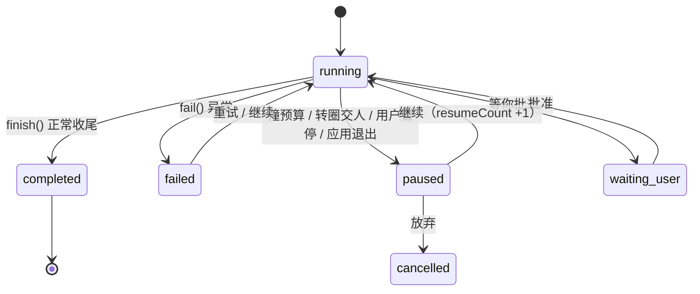

# Runtime 状态机

> 回答一个问题：**Agent 怎么开始、怎么停、怎么接着做、崩了算什么。**
>
> 数据形状看 [`数据模型.md`](数据模型.md)；名词解释看 [`核心概念.md`](核心概念.md)；
> 权限与安全边界看 [`安全模型.md`](安全模型.md)。
>
> ⚠️ 这份文档**只描述已经实现的东西**，不写「打算做成什么样」。

## 四层，别混

一次「你说一句 → 它做完停下」里其实套着四层状态。它们**各自独立**，
混在一起看就会出现「任务在跑但界面是暂停」这类误判：

| 层 | 是什么 | 状态住在哪 | 有几个状态 |
|---|---|---|---|
| **任务** | 一件活（可以跑很多次、可以恢复） | `data/tasks/<id>.json` 的 `status` | 6 |
| **一次执行** | 你在某条任务上按了一次「发送/继续」 | 内存 + 台账的 `resumeCount` / `pausedAt` | 见下 |
| **回合** | 调一次模型 | 内存（`loop.cjs` 的 `turn`） | — |
| **工具调用** | 读文件 / 跑命令 / 写文件… | 任务 `steps[]` 的 `intent` / `completed` | 4（含**结果不明**） |

界面上的**相位**（`idle / thinking / planning / executing / verifying / responding …`，
13 个）来自 `core/lifecycle.cjs` 的 `PHASES`，那是**给状态栏用的**，
和任务状态不是一回事 —— 别拿它当状态机。

## 任务状态（6 个）

```
running ──┬─→ completed      干完了
          ├─→ failed         出错了（错误原文在 task.errors[]）
          ├─→ cancelled      用户放弃
          ├─→ paused         停住了，**能接着做**（撞预算 / 转圈交人 / 按了暂停 / 关掉应用）
          └─→ waiting_user   在等你确认（权限弹窗那一类）
paused / waiting_user ──→ running   （点「继续」）
任意状态 ──→ cancelled              （任务中心放弃）
```



**`paused` 不是失败**，这是这套设计里最要紧的一条：它还带着 `nextAction`、
检查点、改动事务（未提交），点「继续」就从原地接着往下走。

### 谁会把状态改成 paused

| 触发 | `pauseReason` | 代码 |
|---|---|---|
| 撞任务预算（轮数 / 工具次数 / 时长 / token） | `budget` + `budgetHit` | `core/budget.cjs` |
| 转圈检测交给人（改道几次还不听） | `loop` + `loopHit` | `core/loop-run.cjs` |
| 你按了暂停 / 停止，或点了别的会话 | 空 | `core/loop-run.cjs`（AbortError 分支） |
| 应用退出（`will-quit`）或上次是被强杀的 | `interrupted` | `core/task.cjs` 的 `pauseRunning()` |
| 你可以自己在任务卡片上填预算 | — | 见 `docs/安全模型.md` 的预算一节 |

> `pauseRunning()` 有两个调用点：退出时、以及**启动时扫上一轮的遗留**。
> 强杀 / 崩溃退出时 `will-quit` 根本不跑，任务会一直卡在 `running` ——
> 那个「启动时扫一遍」就是为它准备的（真机上复现过：任务看得见、点不了继续）。

## 一次执行的收尾（四条路）

都在 `core/loop-run.cjs`，**一条都不许漏**：

1. **干完了** → `taskCore.finish(completed, result)`
2. **没干完但还能接** → `status: paused`（带 `budget` / `loop` 的原因和数字）
3. **被中断（AbortError）** → `paused`，事务**不提交**（还能整批撤）
4. **报错** → `taskCore.fail(...)` → `failed`，错误原文进 `task.errors[]`

## 工具调用：意图 → 执行 → 结果（含「结果不明」）

`core/task-intent.cjs` 定了一条铁律 —— **先落意图、再执行**（顺序颠倒就等于没记）：

```
markIntent()   执行之前：step 上写 intent{tool, commandHash, startedAt} + completed:false
   ↓ run()
markCompleted() 返回（或抛错）之后：写 completed:true / ok / outcome / summary
```

于是「进程在命令跑到一半时被强杀」在磁盘上只剩一个特征：**一条 `completed:false` 的意图**。
恢复器看到它必须明白：**这条命令动过、但结果不知道**。这时候：

- 不能当它没跑过直接重跑（可能已经产生了副作用）
- 也不能简单当 `failed`（它可能已经成功了）

所以状态是 **「结果不明」**（`isPending(step)`）。读老台账时要按「不可判定」处理 ——
老数据既没有 `intent` 也没有 `completed`，**不许当成「没跑过」**。

> ⚠️ 一次调用在 `steps[]` 里是**两条**记录（意图那条 + 带 `args` 的那条流水）。
> 统计、展示时二选一，别双计。

## 恢复

| 场景 | 怎么认出来 | 做了什么 |
|---|---|---|
| 应用正常退出 | `pauseRunning('exit')` | 在跑的任务标 `paused` / `interrupted` |
| 强杀、崩溃 | 启动时 `pauseRunning('startup')` | 同上（这是唯一能救回来的地方） |
| 你点了「继续」 | `core/task-resume.cjs` | `reopen()`，`resumeCount + 1`，`pauseReason` 清空 |
| 期间文件被别的东西改过 | `task.recovery` 的 `envChanged` | 启动时提示「其中 N 条要动的文件已经变过了」，**不依赖缓存** |
| 上一轮有结果不明的命令 | `task-intent.isPending()` | 恢复前先问人，不静默重跑 |

## 谁改状态（排查入口）

想确认「这条任务怎么变成这样」，按这个顺序看：

1. `data/tasks/<id>.json` 的 `status` / `pauseReason` / `pauseDetail` / `resumeCount`
2. `steps[]` 里有没有 `completed:false`（结果不明）
3. `data/logs/<本地日期>.log` 里同一条任务的行（`任务没跑完` / `启动时把 N 条…标为暂停`）
4. `data/audit/` 里那次工具调用的记录（谁批的、成没成）
5. `npm run doctor` —— 有没有「清单与文件对不上」这类**数据本身**的问题

## 改这套东西时的纪律

- 动 `loop.cjs` / `task.cjs` / `session*.cjs` / `changeset.cjs` 属于**硬禁区**（AGENT.md 第 3 节），
  先停下来说清要改什么
- 任何影响 Runtime 状态的改动，都要把 **暂停 / 继续 / 停止 / 重启 / 崩溃** 这五条路想一遍
- 任何有外部副作用的操作，都要想 **重跑一次会不会做出两份**（幂等/结果不明）
