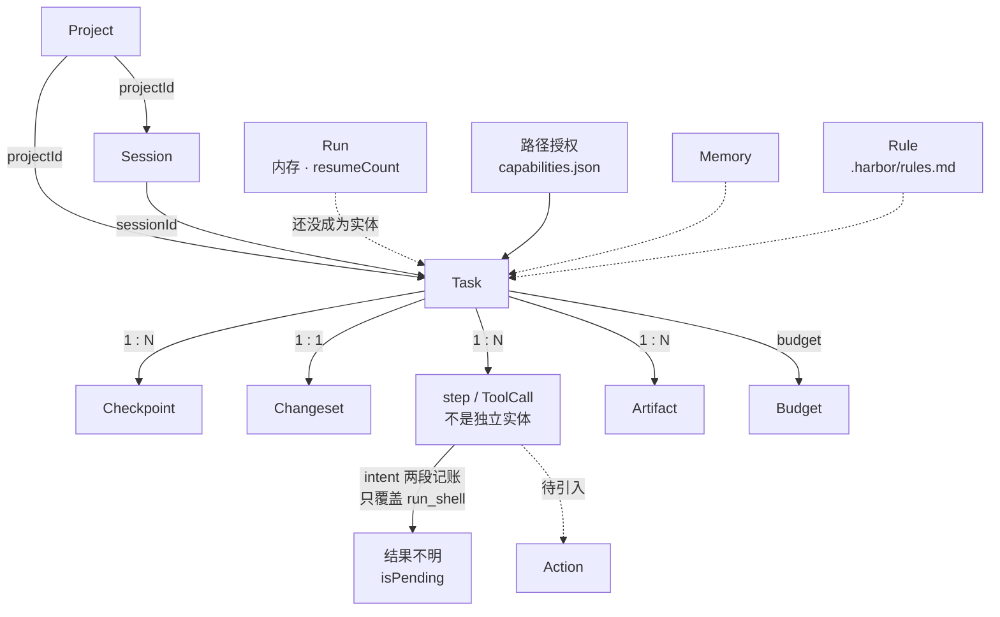

# Runtime 领域模型（收敛设计）

> 回答一个问题：**Harbor 这个 Agent Runtime 里到底有哪些对象、谁指向谁、哪些还没有。**
>
> 这份是**设计稿（目标态）**，不是现状说明书。现状看
> [`Runtime状态机.md`](Runtime状态机.md)（状态怎么流转）、[`数据模型.md`](数据模型.md)（磁盘上有什么）、
> [`核心概念.md`](核心概念.md)（名词解释）。三者回答「现在是什么样」，这份回答「打算收敛成什么样、怎么一步步过去」。
>
> ⚠️ 规矩（和另外三份一样）：**写「已完成」必须附可跑的验证或一次真实观察**
> （`AGENT.md` 硬约束 7）。这份里凡是标「目标」的，都还没实现 —— 别当现状引用。
>
> 起因：`E:\Download\Harbor Agent 1.30+ 短期维护与架构收敛计划`（2026-10-07 拿到）。
> 这份把那份计划里**与代码对得上的部分**落成 Harbor 自己的口径 —— 对不上的（计划以为没有、其实已有）也逐条标出来。

---

## 一、为什么要这份文件

Harbor 已经有一堆核心概念（Task / Session / Turn / ToolCall / Checkpoint / Changeset /
Subagent / Capability / Provider / Artifact / Memory / Project / Rule / Budget…）。
问题不在「概念少」，在**同一个词在两处意思不一样**，以及**新能力不断造新的 Runtime 特殊逻辑**。

这份要做三件事：

1. **把对象清单和关系定死一处** —— 键名 / 字段名 / 事件形状不能再两边各写一套
   （`AGENT.md` 硬约束 9：跨模块约定只有一处真相源）。
2. **把「已有 / 半有 / 缺失」标清** —— 免得把已经做过的当新活重做
   （这份就纠正了收敛计划里 3 条判断）。
3. **给每个缺口一份可执行规格**（动哪些文件、什么形状、怎么验），批准后照着做。

---

## 二、对象全景

### 2.1 三层，别混

对象不是平铺的，分三层。混着看就会追问「`turn` 为什么没有 id」（因为它是运行时概念，不落盘）：

| 层 | 是什么 | 落盘吗 | 对象 |
|---|---|---|---|
| **实体层** | 有 id、有文件、能被人打开 | 是 | Project · Session · Task · Changeset · Checkpoint · Artifact · Memory · Skill · Capability(grant) · Rule · Budget |
| **运行时层** | 一次执行过程中的概念，活在内存 | 否（或只有计数） | Run · Turn · ToolCall · Subagent(child) |
| **待引入层** | 收敛计划要新建的抽象 | — | **Action** · **Decision** · **Capability(registry)** · **Provider** |

> `Capability` **现在同时指两件事**，这是第一处必须澄清的歧义：
> - `core/capability.cjs` + `data/capabilities.json` = **路径授权**（这个目录许不许读写）
> - `core/provider-capabilities.cjs` = **模型能力探测**（这个模型支不支持工具/图片）
>
> 两者语义完全不同却同名。收敛计划里的 `Capability`（能力注册表）是**第三种**。
> 这份文档一律写全：**路径授权** / **模型能力** / **能力注册表（目标）**。

### 2.2 关系图（现状）



### 2.3 目标链条（收敛计划给的）

计划要的是这条链能**稳定跑**，且新增能力不再造特殊逻辑：

```text
Goal → Intent → Task → Capability(能力注册表) → Action
     → Permission / Risk / Cost → Runtime → Verification → Result / Evidence
```

**这份文档的重点就是中间那段**：把 `Action` 和 `Decision` 补上，让 `Risk / Scale / Permission`
挂到 `Action` 上，而不是散在各个工具分支里。

---

## 三、现状分级（逐条对代码核过）

| # | 计划项 | 现状 | 证据（代码） |
|---|---|---|---|
| P0-1 | Runtime Domain Model | **半有** | 四层已分（`Runtime状态机.md`）；但没有独立 `Run` 实体、没有 `Action`/`Decision` 抽象 |
| P0-2 | 防 Task 膨胀（加字段先证明不属于别的实体） | **已有** | 已升格成硬约束 —— `AGENT.md` 硬禁区 11 |
| P0-3 | 统一 Action Model | **半有**（1–3 步已落地） | 有 `core/action.cjs`（组装 risk/scale/scope/reversibility）+ 挂进 `agent.tool.started` 与 `task.steps[].action`；权限判断尚未收到 Action 上（4.2 步骤 4） |
| P0-4 | Risk / Scale / Permission 拆两个维度 | **分散** | `risk.cjs`（risk-patterns / risk-targets）与 `scale.cjs`（scale-signals / scale-config / scale-files）各判各的；未挂到同一点 |
| P0-5 | 统一 Decision Model | **底层已统一，上层两套** | 底层 `confirm-bridge.cjs` 一条往返；上层 `handlers/chat-confirm.cjs` 的 `askUser`（布尔）/ `askClarify`（对象）两套形状 + UI 两种卡 |
| P0-6 | Subagent 只读 | **已有** | `core/subagent.cjs` 就是只读侦察兵 |
| P0-7 | Runtime Event Contract | **出口已统一，契约未定义** | 主进程内 `events.cjs`（16 个 `agent.*` 标准名 + 环形缓冲 + 落盘）；推渲染层单通道 `chat:event`（`chat-emit.cjs`，靠 `type` 区分） |
| P0-8 | 跨层契约测试 | **部分** | 内核自检（`npm test`）+ 单测（`npm run test:unit`）+ 真机 CDP 脚本都有；但没有「Backend→IPC→Renderer→Persistence→Reload」的**整链**用例 |
| P0-9 | 测试数据隔离（绝不碰真 data） | **已完成** | `data/selftest-data` / `data/unit-test-data`（`paths.cjs` 的 `isolationDirName()`；`vitest.config.ts` 注入 `HARBOR_UNIT_TEST=1`） |
| P0-10 | Data Doctor 关系完整性 | **基础有，缺关系检查** | `npm run doctor`（`core/data-doctor.cjs`）已在跑；但「Action.runId 必须存在」这类关系要等 Action 落地才有对象可查 |

**一句话**：P0-2 / P0-6 / P0-9 **已完成，别重做**；P0-1 / P0-5 / P0-7 **是"半有、要收敛"**；
P0-3 / P0-4 / P0-10 **是真缺口**，而且 4 依赖 3（Action 是它们的挂靠点）。

---

## 四、四个收敛项（目标形状 + 可执行规格）

> ⚠️ 下面每一项**都触发 `AGENT.md` 第 3 节的硬禁区**（改 3+ 文件 / 动 IPC / 动内核关键文件 /
> 改数据结构）。所以它们**只是规格，不是待办**：要动之前先按这份说清「要动什么、为什么、风险」，
> 等确认。第七节列了每一项撞的是哪条红线。

### 4.1 Decision Model 统一（P0-5） ✅ 已实现（2026-10-07）

> **落地**：新增 `electron/core/decisions.cjs`（类型 / 元数据 / 公共字段 / `exitsIn` 的**唯一
> 真相源**）。两条往返都过 `decisionFields()` 组装，事件多了 `decisionType`，渲染层按它分流
> （老版本主进程没带时退回看 `kind`）。下面「现状 / 目标形状 / 规格」是**设计时的原样记录**，
> 留着看「为什么这么定」；现状读代码。
> 钉子：自检 `125-decision-shape`（类型集合两边源码抠出来**断言相等** + 两条往返公共字段对齐）；
> 单测 `src/stores/thread/__tests__/decisionRouting.test.ts`。

**现状**（底层比计划以为的更统一）：

- 一条往返核心：`core/confirm-bridge.cjs` 的 `ask()` / `settle()` / `settleAllFor()` /
  `settleAsTimeout()`，`pending` 是 `Map<confirmId, {resolve, timer, owner}>`，`owner` = 对话的 `requestId`。
- 两条上层：`handlers/chat-confirm.cjs` 的 `askUser`（审批，resolve `approved: boolean`）与
  `askClarify`（澄清，resolve `{answers, skipped, timeout, cancelled?, rephrase?}`）。
- 单通道回话：`chat:confirm`（第三个参数 `answer` 是 AG-053 加的可选答复）。
- 推卡事件：`chat:event` 里 `type: 'confirm_request'`；收卡 `'confirm.timeout'` / `'clarify.timeout'`。

**核心问题**：**同一条底层往返，上层回话形状不同** → 渲染层要按「这是审批还是澄清」分两套解析
（`approved` vs `answer` JSON）。僵尸卡 bug（2026-10-07）就出在这条缝上。

**目标形状**：

```text
Decision {
  decisionId      // 就是现在的 confirmId
  type            // 'approval' | 'clarify' | 'recovery' | 'rollback' | 'steering'
  sessionId       // 认领用（两条往返必须都带 —— 见下）
  taskId
  runId           // 有 Run 之后补；现在留空
  actionId        // 有 Action 之后补；现在留空
  question        // 给用户看的那句话
  options[]       // { label, effect, isDefault }
  defaultOption
  timeoutPolicy   // 'reject'（审批） | 'accept-default'（澄清） | 'ask'（恢复）
  createdAt
}
```

**为什么值得做**：新增一种「要用户拿主意」的情况（恢复确认 / 回滚预览 / 执行中改方向）
时，不用再建一套 UI + IPC + 状态，只加一个 `type`。

**可执行规格**：

| 步骤 | 动哪 | 做什么 | 验证 |
|---|---|---|---|
| a | `core/confirm-bridge.cjs` | `ask()` 的返回统一成 Decision 形状（保留 `approved` / `answer` 作为**兼容字段**，老解析不破） | 自检组 `101-confirm-bridge` 全绿；**老路径 `approved === true` 语义不变** |
| b | `handlers/chat-confirm.cjs` | `askUser` / `askClarify` 都返回统一形状；`sessionId` 两条**都必须带**（僵尸卡那条教训） | 自检组 `107`（真往返）+ 新增「两条往返事件形状一致」断言 |
| c | `src/stores/thread/confirmEvents.ts` | 消费统一形状，按 `type` 渲染（不再按「有没有 answer」猜） | 渲染层单测 + 真机：权限卡 / 澄清卡 / 超时收卡三种场景 |
| d | UI 卡片组件 | 两类卡收敛成一个 `DecisionCard`（`type` 决定样式） | `npm run shot:electron -- --js="…"` 真机点一遍 |

**不改通道名**（`chat:confirm` / `chat:event` 保持）→ 不新增 IPC 通道，**不用动 `EXPECTED_CHANNELS`**。
但改了通道 payload 的**字段集合**，属于「跨模块约定」，要按硬约束 9 钉形状对齐测试。

---

### 4.2 Action Model（P0-3） ◐ 1–3 步已落地（2026-10-07），第 4 步待做

> **落地**：新增 `core/action.cjs`（组装）；`tool-runner` 把 action 挂进
> `agent.tool.started` 并写 `task.steps[].action`。**第 4 步（权限判断收到 Action 上）
> 触发硬禁区 10，未做**。下面「现状 / 目标形状 / 规格」是设计时的原样记录。

**现状**：**没有**统一 Action 对象。一次工具调用的信息散在五处：

| 信息 | 现在的家 | 覆盖范围 |
|---|---|---|
| 工具名 + 参数 | `task.steps[]` 里带 `args` 的那条流水 | 全部工具 |
| 意图 / 结果（先落意图再执行） | `task.steps[].intent` + `completed` / `ok` / `outcome`（`core/task-intent.cjs`） | **只有 `run_shell`**（`beginShell` / `endShell`） |
| 重跑会不会做两份（可逆性） | `task-intent.cjs` 的 `REPLAY_UNSAFE`（正则表，**已是单一出处**） | 全部工具（判据一处） |
| 风险 | `core/risk.cjs`（`risk-patterns.cjs` / `risk-targets.cjs`） | 命令类 |
| 规模 | `core/scale.cjs`（`scale-signals.cjs` / `scale-config.cjs` / `scale-files.cjs`） | 命令类 |
| 权限 | `core/capability.cjs` + `data/capabilities.json` | 路径类 |

**核心问题**：这六样东西**没有一个共同的 id 串起来**。想知道「这次 `run_shell` 的风险、
规模、可逆性、授权、结果分别是什么」，得去五个地方拼。也没法做「Action.runId 必须存在」这种关系检查。

**目标形状**：

```text
Action {
  actionId        // 新 id（`act_…`），一次工具调用一个
  taskId
  runId           // 属于哪一次执行（Run 落地后填）
  turn            // 第几轮模型调用
  tool            // 工具名
  args            // 脱敏后的参数（走 redact.cjs）
  risk            // { level, reasons[] }
  scale           // { level, signals[] }
  scope           // 路径授权的判定结果
  reversibility   // 'safe' | 'unsafe'（来自 REPLAY_UNSAFE）
  decisionId      // 若这一步要用户拍板，指向那条 Decision
  status          // 'pending' | 'running' | 'ok' | 'failed' | 'unknown'
  result          // { summary, ms }
  startedAt / finishedAt
}
```

**迁移（硬约束 5：必须写迁移、保留旧数据）**：

- Action **不替换** `task.steps[]` —— 老台账里的 step 既没有 `intent` 也没有 `completed`，
  按 `Runtime状态机.md` 的规矩是「不可判定」，**不能当成没跑过**。
- 新写：一个 Action 落成一条 step（复用现有文件），**加字段不加形状**（老 reader 看不到新字段照常工作）。
  这就是 `task-io` / `artifact` 一贯的「读时兜底、不批量回写」套路。
- `Run` 实体：现在「一次执行」只有 `resumeCount` + 内存。**先不新建独立文件**——
  等 Action 稳了再评估要不要把它落成实体（避免一次性改两处数据结构）。

**可执行规格**：

| 步骤 | 动哪 | 做什么 | 验证 |
|---|---|---|---|
| a | `core/task-intent.cjs` | 把「意图账」从**只覆盖 `run_shell`** 扩到全部有副作用的工具（`REPLAY_UNSAFE` 命中者） | 自检：非 shell 工具也留 `completed:false` |
| b | 新增 `core/action.cjs` | 组装 Action（聚合 risk / scale / scope / reversibility），**只新增文件不动内核** | 单测：组装出的形状带全部字段 |
| c | `core/tool-runner.cjs` / `core/loop-tools.cjs` | 每个工具调用产生一条 Action；仍写回 `task.steps[]` | 自检 + 真机跑一次 `run_shell` 看台账 |
| d | `loop.cjs` / `task.cjs` | 把 Task 的「动作名」与 Action 对齐（**内核关键文件，最谨慎**） | 旧 data 实测能读 + `npm run doctor` |

**接入设计（细化到函数 —— 2026-10-07 补）**

唯一生产点是 `core/tool-runner.cjs` 的 `runOne()`：它已经拿着 `call.name` / `args`
（第 87 行）、发 `agent.tool.started`（第 124 行）、写台账 `taskCore.addStep`（第 166 行）。
Action 就在**这一处**组装 —— 别处不要再拼一份（硬约束 9）。

组装函数（步骤 b **已落地**：`electron/core/action.cjs`）：

```text
of({ name, args, workdir, userText, limits }) → Action
  risk          ← risk.classify(command)              （只 run_shell）
  scale         ← scale.inspect({ name, args, … })     （level / kind / scope / estimate）
  scope         ← scale.scope
  reversibility ← task-intent.isReplayUnsafe(name) ? 'unsafe' : 'safe'
```

纯函数、不 require electron；自检 `127-action` 钉「每一条都和**现成的家**一致（不重判）」。

分步落地 —— **每步单独提交、单独验证、可单独回滚**：

| 步 | 动哪 | 风险 | 状态 |
|---|---|---|---|
| 1 | 新增 `core/action.cjs` + 自检 `127` | 低（不动内核） | ✅ 已落地 |
| 2 | `tool-runner` 把 action 挂进 `agent.tool.started` 的 payload | 低（只加字段） | ✅ 已落地 |
| 3 | `tool-runner` 写 `step.action` | 中（**改数据结构** — 硬禁区 3） | ✅ 已落地 |
| 4 | Permission 判断从各 gate 收到 Action 上（P0-4 / P0-10） | 高（**权限行为**） | 待做 |

步骤 4 触发**硬禁区 10**（`risk.cjs` 在权限 / 安全模型名单里）：动手前先把「这次不做什么」
写进 [`安全模型.md`](安全模型.md)。

**最难的一步**是 (c)：`tool-runner` 是所有工具的必经之路，接错了会**静默改坏所有工具**。
所以这一步必须**真机走一遍**（`AGENT.md` 收工必跑那条：测试全绿 ≠ 能用）。

---

### 4.3 Runtime Event Contract（P0-7）

**现状**：**出口已经统一**，缺的是**渲染层消费侧的显式契约**。

- 主进程内：`core/events.cjs` 一个总线，16 个 `agent.*` 标准名（`AGENT_EVENTS`），
  环形缓冲 300 条 + 落盘 `data/events/<日期>.jsonl`（增量不落盘）。
- 推渲染层：`core/chat-emit.cjs` 的 `createEmitter` → 单通道 `chat:event`，
  payload `{...event, requestId}`（`requestId` **必须最后展开**，否则顶掉确认事件 —— 2026-09-25 真机踩过）；
  正文/思考增量走批处理（20 条/秒）。
- 渲染层：`src/stores/thread/turns.ts` 按 `event.requestId` 过滤。

**核心问题**：事件 `type` 的**全集**没有一处定义。主进程发什么、渲染层认得哪些，
两边各写各的（典型「同一件事写两份」，硬约束 9 的老病）。

**目标形状**：

- 一份 `src/types/events.ts`（或对齐 `src/lib/schemas.ts` 的口径）：`AgentEvent` 联合类型，
  列出 `type` 全集 + 每个 `type` 的 payload 形状。
- 主进程侧 `chat-emit.cjs` **从同一份清单导出**（或加自检：主进程用到的 type ⊆ 清单）。
- 新增自检：**主进程发的事件 type 集合 ↔ 渲染层处理的事件 type 集合，两边一致**
  （硬约束 9 的「字符串契约要从源码里抠出来真跑一遍」）。

**可执行规格**：

| 步骤 | 动哪 | 做什么 | 验证 |
|---|---|---|---|
| a | 新增 `src/types/events.ts` | 定义 `AgentEvent` 联合类型（type 全集 + payload） | `npm run typecheck` 0 错误 |
| b | `core/chat-emit.cjs` | 导出「主进程会发的 type」清单；与 (a) 对齐 | 自检：两边集合相等（差异即报红） |
| c | `src/stores/thread/*.ts` | 消费点用类型收窄，去掉「靠别的字段猜 type」 | 渲染层单测 |

**这一步是最能立刻见效的**：僵尸卡那类「UI 靠猜后端状态」的 bug，根因就在缺这份契约。
但它**新增/改动跨模块约定**，按硬约束 9 要先钉形状测试。

---

### 4.4 Risk / Scale / Permission 拆成两个维度（P0-4）

**现状**：`risk.cjs` 与 `scale.cjs` **各判各的**，没有共同的挂靠点。计划要求把它们变成
**两个正交维度**：

```text
删一个临时文件       Risk: High    Scale: Single
读 10000 个文件      Risk: Low     Scale: Large
递归删 5000 个文件   Risk: Critical Scale: Large   ← 三者的处置逻辑完全不同
```

**目标**：Risk（危不危险）与 Scale（动多大）分开判，各自挂在 4.2 的 Action 上；
Permission 由「Risk + Scale + Scope」共同决定要不要弹卡。

**可执行规格**：

| 步骤 | 动哪 | 做什么 | 验证 |
|---|---|---|---|
| a | `core/scale.cjs`（现有 `scale-*`） | 确认规模判据按**实际信号**（文件数 / 字节数）而非**命令形态** | 真机：`dir` 一个大目录 vs 一个小目录，判定不同 |
| b | `core/risk.cjs` | 与 scale 解耦，输出 `{level, reasons[]}` | 自检：三种示例场景跑到三种不同结论 |
| c | Action 组装点（4.2 b/c） | 把 risk / scale / scope 一起塞进 Action | 单测：Action 带三样 |

> 这里有个**已知欠账**（`improvement-checklist.md` 的 P4-1 记着）：规模闸门现在按**命令形态**拦，
> 不是按实际规模。这一项顺手把它收回来。

**⚠️ `risk.cjs` 在硬禁区 10 的名单里**（权限 / 安全模型）——动它之前必须先把「这次不做什么」写进
`docs/安全模型.md`。

---

## 五、迁移与兼容（硬约束 5）

通用规矩，四个收敛项都适用：

1. **不就地删旧数据**。新字段只加不换；老 reader 看不到新字段照常工作
   （`task-io` / `artifact` 的「读时兜底」套路）。
2. **老台账当不可判定**。`task.steps[]` 里没有 `intent` 也没有 `completed` 的，**不许当成没跑过**
   （`Runtime状态机.md` 的「结果不明」一节）。
3. **不新建并列的数据结构**。Action **复用** `task.steps[]`，不新开 `data/actions/`
   （同义字段/结构比缺字段更难收 —— 硬禁区 11 的教训）。
4. **拿旧 data 实测启动一次**才算验过（不是「新 data 能跑」）。

---

## 六、执行顺序与依赖

顺序**不是**照抄 P0-1…P0-10，而是按依赖 + 风险 + 能否单独验证重排：

```text
1. Domain Model（本文档）          ← 零代码，先把名词定死
2. Decision 统一（4.1）            ← 真 bug 住在这；底层已统一，风险较低
3. Event Contract（4.3）           ← 依赖 2 的形状
─────────── 以上是「低风险、能立刻见效」的前半段 ───────────
4. Action Model（4.2）             ← 最大一块；动内核关键文件 + 改数据结构
5. Risk / Scale 拆分（4.4）        ← 依赖 4 的挂靠点
6. Data Doctor 关系检查（P0-10）   ← 依赖 4 落地才有对象可查
```

**贯穿**：P0-8（跨层契约测试）**不单独排期** —— 上面每一步都跟着加
「Backend → IPC → Renderer → Persistence → Reload」那一条链的用例。

---

## 七、边界（这项活撞了哪些红线）

| 收敛项 | 撞的硬禁区（`AGENT.md` 第 3 节） |
|---|---|
| 4.1 Decision | 动 3+ 文件；改跨模块约定（硬约束 9） |
| 4.2 Action | **动内核关键文件**（`loop.cjs` / `task.cjs`）+ **改数据结构**（硬禁区 3、8） |
| 4.3 Event Contract | 改跨模块约定；若动通道要同步 `EXPECTED_CHANNELS`（硬禁区 9） |
| 4.4 Risk / Scale | 动 `risk.cjs`（**硬禁区 10**：权限 / 安全模型） |

所以这条线**不能一次推到底**。做法：**先记账（本文档）→ 逐项拿到批准 → 每项单独提交、单独验证**。

**这份文档本身不碰任何代码**，它只是把「批准时要看的东西」准备好。

---

## 八、这份文档怎么维护

- 某个收敛项**做完了** → 把 4.x 那节标成「已实现」，并**把现状搬进**
  [`Runtime状态机.md`](Runtime状态机.md) / [`数据模型.md`](数据模型.md)（那两份才写现状）。
- 对象清单变了（新增/删除实体）→ 回来改第二节。
- 别在这份里写「会涨的数字」（自检项数 / 通道数）：要说得写「看输出」（硬约束 8）。
