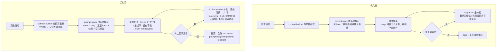

# Token 优化说明（实现结构与配置）

> 依据 `docs/Token优化实施与测试提示词.md`（用户确认以该文档为唯一规范）实施。
> 本文写「改了什么、怎么用、怎么回退」；测试过程与数字见
> [`测试记录/token优化测试.md`](./测试记录/token优化测试.md)、
> 问题与修复见 [`测试记录/token优化问题.md`](./测试记录/token优化问题.md)。

## 一、改动总览

### 新增模块（electron/core/）

| 文件 | 职责 |
|---|---|
| `token-metrics.cjs` | 每请求指标 → `data/logs/token-metrics.jsonl`。缓存字段纪律：DeepSeek `prompt_cache_hit_tokens`/`prompt_cache_miss_tokens`、OpenAI `prompt_tokens_details.cached_tokens`；**供应商没给记 null（unavailable），绝不填 0**；命中率只在 hit+miss 都有时计算 |
| `context-diag.cjs` | 三层上下文诊断：`stablePrefixHash` / `lowFrequencyHash` / `dynamicContextHash` + 每层 token 估算；和上一快照逐层比对，得出 `stablePrefixChanged` 与 `stablePrefixChangeReason`（变了在哪层）。快照按会话存 `data/cache/prompt-diag/<sessionId>.json` |
| `tool-scheduler.cjs` | ① 把一轮 tool_calls 切成批次：连续「只读、无依赖、目标不同」→ 同批并行；写入 / 同目标 / 有依赖 → 串行；② 写操作前后文件 hash 对比（部分成功检测）；③ 同工具同参指纹（重复调用判据） |
| `tool-runner.cjs` | 工具执行器（替代 loop-tools 的串行实现）：并行只读批次（事件带 `toolCallId` 稳定映射；tool 消息仍按原始顺序入队）、写失败时部分成功检测提示、结构化失败摘要、调用统计进台账 |
| `templates.cjs` | 任务模板（fix-bug / add-feature / refactor / read-explain / run-tests，带 `id@version`）：只给**建议计划**，进任务状态层；命中记进台账 |
| `prewarm.cjs` | 启动预热（**默认关**）：`cache.prewarm=true` 才发一次「只带稳定前缀 + 固定短词」的请求（maxTokens=1、温度 0、不含用户会话正文），用量记 `kind=prewarm` |

### 修改的既有模块

| 文件 | 改动 |
|---|---|
| `llm.cjs` | 每请求记 TTFT / 延迟 / 重试序 / usage（含缓存字段）→ token-metrics；返回值带 `ttftMs`/`latencyMs` |
| `loop-model.cjs` | `mergeUsage` 累计缓存字段（以前只合三个总数，命中数据被丢）；每次尝试带 `retryIndex`，结果带 `retryCount` |
| `loop-prompt.cjs` | 接线 context-diag（算 hash、记台账、变了发 warn）；模板建议注入任务状态层；失败注记升级为**结构化失败摘要**（error_kind / 目标 / retry_count / 部分成功警示）；软预算时记忆配额减半 |
| `loop.cjs` | 软阈值触发时向模型推一条「预算提醒」（只提醒一次、不阻断） |
| `budget.cjs` | 新增 `softRatio`（默认 0.8）：`atTurnBoundary` 出 `soft/softReason/softUsed/softLimit`；`softNote()` 提醒文案（砍解释不砍验证） |
| `task-notes.cjs` | 台账新字段：`recordPromptDiag`（promptDiag + 最近 20 条 ring）、`recordTemplate`、`bumpToolStats` |
| `stats.cjs` | 桶新增 `cacheMiss`（服务端显式给的未命中数） |
| `compact.cjs` | 冻结摘要**版本化**：`【之前对话的摘要 vN】`，不原地重写；旧格式（无版本号）兼容 |
| `tools/_shared.cjs` | `truncateMiddle` 带标准截断标记（`omitted_chars` / `original_bytes` / `reason`）；新增 `truncateWithLog`（截断前把全文落 `data/logs/tool-output-*.log`，标记里给完整输出路径） |
| `tools/run_shell.cjs` | 命令输出截断 → `truncateWithLog` |
| `tools/read_file.cjs` | 内容缓存命中计数（进台账 `toolStats.cacheHits`） |
| `main.cjs` | 启动时挂 `prewarm.maybeRun()`（默认不做事） |
| `config-defaults.cjs` / `config-normalize.cjs` | 新配置：`budget.softRatio`（0~1，默认 0.8）、`cache.prewarm`（默认 false） |
| `loop-tools.cjs` | 串行实现改名 `executeToolCallsSerial` 保留作回退/对照；默认导出 `tool-runner` 的执行器 |
| `task-hint.cjs` | 新增 `isFreshTaskState`（模板守卫从「taskState 非空」改为等值判断 —— 修 TOK-P2-004，模板层曾在真机恒短路） |
| `scripts/selftest/groups/85-token-opt.mjs` | 新自检组：覆盖上述全部新模块与接线（不联网） |

### 请求组装流程图（优化前 → 优化后）

- 两侧共用同一条装配链（`loop-prompt` → `context-builder` + `prompt-stack`）；优化新增的是**观测与执行策略**，不改消息语义。
- 发送前：模板建议注入任务状态层（仅在「新活第一轮」，队列见 `task-hint.isFreshTaskState`）；稳定前缀意外变化时 `log.warn` 写变化层名。

## 二、三层上下文与稳定前缀

- 分层映射（context-diag 与 `prompt-stack.ORDER` 对齐）：
  - **稳定层**：coreIdentity / environment / conversationPolicy / userPreferences / projectInstructions / skills / tools / toolPolicy / browserGuide / workRules / safety
  - **低频层**：relevantMemory / taskState / conversationState
  - **动态层**：retrievedContext / currentTime
- 当前时间仍**固定在系统提示最末**（v1.18 起就是这么做的：它是唯一每轮都变的内容，放前面会冲掉整个前缀缓存）。
- 诊断字段只进台账（`task.promptDiag` + 20 条 ring）与日志，**不进发给模型的稳定前缀**。
- 稳定前缀意外变化会写 `log.warn`（带变化层名），便于事后追因。

## 三、锚点与冻结摘要

- **强锚点**（目标/约束/安全边界）= `taskState` + `workRules` + `safety` 层：每轮注入；总量沿用 context-builder 的预算分割（未新增独立限长器 —— 已如实记录为后续项）。
- **弱锚点** = `relevantMemory`（按相关性 Top 选取，查询词 = 最近一条用户消息）+ 冻结摘要。
- **临时内容** = 工具结果与 `retrievedContext`（仅当轮有效）。
- **冻结摘要版本化**：compact 每次生成 `vN` 块、不原地重写；报告里可按版本对账。

## 四、工具调用与结果压缩

- **并行**：同一轮里「连续、只读、目标不同」的调用并行执行（计划见 `tool-scheduler.planBatches`）；写入/同目标/依赖一律串行。事件带 `toolCallId`，tool 消息按原始顺序入队。
- **截断标记**：统一 `[截断] omitted_chars=… · original_bytes=… · reason=…`；shell 输出超限时先把全文落 `data/logs/tool-output-<ts>.log`，标记里带路径（原始日志路径纪律）。
- **文件缓存**：沿用既有 `file-cache.cjs`（键含路径 + 内容 hash + mtime/size），命中计数进台账；写入与恢复路径仍沿用既有失效机制（AG-019 起就在做）。
- **无效调用率口径（固定）**：`invalid = 重复调用（同工具同参） + 参数非法`，与总调用数一起记进台账 `toolStats`。

## 五、失败重试

- 失败注记从「名字 + 提示」升级为**结构化摘要**：`error_kind` / 目标 / `retry_count` / 部分成功警示（文件已被创建或可能已部分修改 → 先 read_file 看现场，别盲目重来）。
- 写操作失败时 `tool-runner` 对比目标文件前后 hash —— 被改过就强制提示「重试前看现场」。
- 每请求指标带 `retryIndex`（第几次尝试），重试不再与首跑混在一起统计。
- 沿用既有错误分类（`errors.cjs`）：认证/权限/取消/确定性参数错误不自动重试。

## 六、跨任务模板与预算

- 模板：`fix-bug` / `add-feature` / `refactor` / `read-explain` / `run-tests`（`id@version`）；只建议步骤、不绕过检查；命中记台账（`templateId`/`templateVersion`）。
  - ⚠️ 真机踩坑（TOK-P2-004）：守卫不能用「`taskState` 非空」判断「已有计划」—— 新活首轮注入的 `freshRequest`（「本轮请求（还没立任务）」）也是非空，导致模板层一度真机永不生效。现改 `taskHint.isFreshTaskState` 等值判断（见 `task-hint.cjs`）。
- 预算：硬上限沿用既有四账；新增 **软阈值 0.8**（可配 `budget.softRatio`，0=关）：
  - 到线只提醒、不阻断；提醒文案强调「优先完成可验证步骤，保留文件验证与安全检查」；
  - 只在第一次触发时提醒一次；
  - 软态下上下文装配把**记忆配额减半**（先砍低相关记忆）。

## 七、指标与落盘

| 位置 | 内容 |
|---|---|
| `data/logs/token-metrics.jsonl` | 每请求一行：label/model/retryIndex/prompt/completion/total/cacheHit/cacheMiss/cacheSource/hitRate/ttftMs/latencyMs（`kind=llm|prewarm`） |
| 任务台账（`data/tasks/*.json`） | `promptDiag` + `promptDiags[≤20]`；`templateId/templateVersion`；`toolStats{calls, invalid, duplicates, cacheHits}`；既有 `tokens*`/`retries` |
| `data/logs/tool-output-*.log` | 被截断的命令完整输出（按需留档） |

## 八、配置与回退

| 开关 | 默认 | 回退方式 |
|---|---|---|
| `budget.softRatio` | 0.8 | 设 0 关闭软提醒 |
| `cache.prewarm` | **false** | 不开就完全没有预热请求 |
| 工具并行 | 开 | `loop-tools.executeToolCallsSerial` 保留完整串行实现（改回一行导出即回退） |
| 三层诊断 | 开（只记台账/日志） | 关：不调 `recordPromptDiag`（不影响请求内容） |
| 模板建议 | 开 | 删 `templates.cjs` 引用或把 match 留空即无建议 |

- **数据迁移**：无破坏性变更。新字段都有默认值；旧台账文件缺新字段时按缺省处理（read 路径全部带兜底）。旧格式冻结摘要（无 `vN`）能被继续识别与计数。
- **不引入任何新依赖**；不改变既有数据文件格式；不触碰用户真实 `data/`（测试全程用隔离副本 `tmp/tok/Harbor`）。

## 九、已知未做 / 后续项（如实记录）

1. **按阶段/复杂度动态设置 `max_tokens`**：本轮未实现（沿用既有设置），原因是需要真实基线先证明「截断风险 > 省下的输出」；已列入后续。
2. **强锚点独立限长器**：未单独实现（沿用 context-builder 预算分割；软预算下记忆减半）。
3. **预热可取消**：预热是单次短请求（maxTokens=1），未做中途取消入口；失败静默不影响启动。
4. **模板库仅 5 条**：按文档范围起步，其余场景后续按真实任务沉淀。
