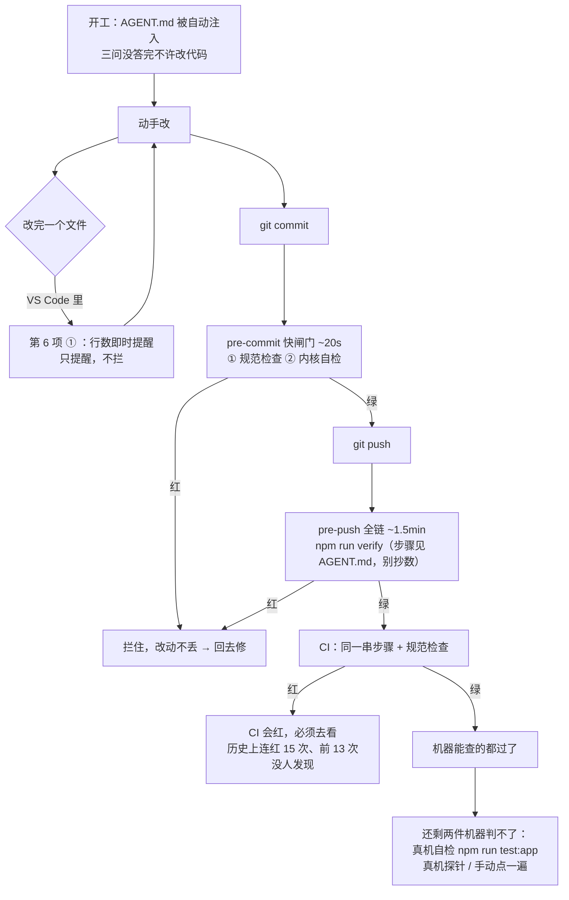

# 约束机制说明

> 一句话：这份文档说明 [`AGENT.md`](../AGENT.md) 里的规矩**靠什么强制**、**每个环节谁在读它**、
> 以及**它自己坏了怎么办**。
>
> 给谁看：接手这个项目的模型 / 未来的自己。看完应该能回答：
> 「规矩写在哪里」「我怎么知道我没踩线」「检查报红时我该改代码还是改检查」。

## 0. 为什么需要它（都是真实事故，不是假设）

| 时间 | 事故 | 当时为什么没拦住 |
| --- | --- | --- |
| 2026-09-23 | 单文件 300 行红线**被破了 3 个文件** | 规矩只写在 `AGENT.md` 里，靠自觉；**没有任何测试会报出来** |
| 更早 | 「发不出消息」上过线 | 过了 tsc + lint + 全部单测 —— 测的是**函数**，不是**真机能不能用** |
| 更早 | 「流式内容全不更新」上过线 | 同上；拆文件时切多了，`tsc` 全绿 |
| 更早 | 本地全绿，CI **连红 15 次**（前 13 次没人发现） | 没人看 CI，也没有任何东西会催着看 |
| 2026-09 | 文档里的「六条硬约束」和 `AGENT.md` 的**条目数对不上** | 同一件事写了两份，改了一处忘了另一处（IPC 通道数、内核自检项数这类数字，历史上漂过三次） |

结论很简单：**能机械查的，就不许靠自觉。** 这份文档描述的机制就是干这个的。

## 1. 这套东西由哪些文件组成（各自回答什么问题）

| # | 文件 | 回答什么 | 谁在读它 | 什么时候生效 |
| --- | --- | --- | --- | --- |
| 1 | [`AGENT.md`](../AGENT.md) | **规矩、禁区、验证纪律**（唯一真相源） | Harbor 应用每轮对话**自动注入**；人和 agent 也读 | 一直 |
| 2 | [`docs/开发流程.md`](开发流程.md) | 一件事分几阶段、开工前问什么、收工报告写什么 | 人 / agent | 每个任务开工与收工 |
| 3 | [`scripts/check-rules.mjs`](../scripts/check-rules.mjs) | **能机械查的规矩**跑一遍（门面：怎么跑、怎么报） | `pre-commit` 钩子；人随手也可以跑 | 提交前 + 随手 |
| 4 | [`scripts/check-rules/`](../scripts/check-rules/) | 每项检查的**实现**（行数 / 依赖 / 密钥 / TODO / AGENT.md / 改动数 / 约束机制在位 / 仓库卫生 / 易漂数字） | 被 3 调用 | 同上 |
| 5 | `scripts/check-rules*.test.mjs` | 检查脚本**自己的测试**（`node --test`）：清单结构 + 每一项的行为 | 人 / CI | 改检查时 |
| 6 | [`.github/hooks/`](../.github/hooks/) | ① `line-limit.json`：给 VS Code agent 的**即时提醒**（每次改完文件跑一次）<br>② `pre-commit` / `pre-push`：git 钩子（转发到 `scripts/hooks/*.mjs`） | VS Code agent / git | 改完文件 / 提交 / 推送 |
| 7 | 本文（`docs/约束机制说明.md`） | 机制本身怎么工作、怎么维护、坏了怎么办 | 人和 agent | 你要动这套机制时 |
| 8 | [`scripts/lint-kernel.mjs`](../scripts/lint-kernel.mjs) | **内核 `.cjs` 里的未定义标识符**（`.cjs` 不过 `tsc`，`node --check` 也只查语法）—— 带允许清单，**清单过期也报红** | `npm run lint:kernel`（已接进 `verify` 与 CI） | pre-push / CI |

> 只有 `AGENT.md`、`docs/开发流程.md`、本文是「给人读的散文」；其余几份都是**会被执行的代码** ——
> 这是有意的：散文会漂，代码跑一遍就知道。

## 2. 一次改动里它怎么工作



**关键分工**：

- **机器能拦的**：类型、风格、格式、行数、依赖两侧一致、明文密钥、AGENT.md 是否被整段覆盖、
  内核自检（**项数每版都会涨，看输出，别抄**）、**内核 `.cjs` 的未定义标识符**、构建能不能过。
- **机器判不了的**（必须人做，报告里要写「怎么跑的」）：**这个功能真机能不能用**、
  需求内部是否自相矛盾、有没有「顺手重构」、有没有偷偷降级。

> 记住本项目的两次事故：**测试全绿 ≠ 能用**。钩子只解决前一类。

**想一次跑全，用 `npm run preflight`** —— 它把「机器能跑的」全跑一遍
（全链 `verify` → 应用自检 `test:app`，可 `--acceptance` 再加真机验收），
最后把「剩下必须人做的」按改动类型列出来。它不是钩子的替代品：
钩子拦「**忘了**跑」，它管「**跑全**」。

## 3. 怎么装 / 怎么确认装好了

```bash
node scripts/hooks/install.mjs          # 一次性：把 core.hooksPath 指向 .github/hooks
node scripts/hooks/install.mjs --check  # 只看状态（不改任何东西）
npm run check:rules                     # 第 7 项检查也会告诉你「钩子已装 / 没装」
npm run preflight                       # 想知道「我到底跑全了没」就用它（见第 2 节末尾）
```

- `core.hooksPath` 是**本地** git 配置（不进仓库）→ **换台机器要重跑一次**。
- 为什么不用 `.git/hooks/`：那目录不提交，别人克隆不到。
- 为什么不用 husky：不引新依赖（`AGENT.md` 硬约束「不轻易引依赖」）。
- 为什么钩子只写「转发」：Windows 上 sh 里的中文和引号很容易出事（本项目踩过），
  所以 `.github/hooks/*` 里只有一行 `exec node scripts/hooks/*.mjs`，逻辑全在 JS 里。

## 4. 检查报红的时候怎么办

| 情况 | 该怎么做 |
| --- | --- |
| 报的是真问题 | 改代码。**不要**为了让检查变绿去改检查。 |
| 你认为它是**误报** | 先按报的改（便宜）；确实不该报 → 走第 5 节的流程改**检查 + 它的测试**，并在交付报告里写「我改了检查，原因是…」。 |
| 检查脚本自己有 bug | 它有单测：`node --test scripts/check-rules.test.mjs scripts/check-rules.meta.test.mjs`。<br>先加一个**会失败的用例**复现，再修。 |
| 钩子本身坏了（跑不起来） | `git commit --no-verify` 绕过，但**必须在报告里说明**；修好后正常提交走钩子。 |
| `npm` 被系统策略挡住（已知：`npm.ps1` 被禁） | 直接跑 node 入口：`node scripts/preflight.mjs`、`node scripts/check-rules.mjs`。钩子不受影响 —— 它内部走的是 `npm-cli.js`，不经 shell。 |
| 改了不该改的东西（偷偷改掉） | 比违规本身更严重 —— 见 `AGENT.md` 第 6 节「违规处理」。发现即停手、上报、记进 `docs/踩坑记录.md`。 |

## 5. 怎么加一条新规矩（四步）

1. **先问「能不能机械查」**
   - 能 → 写成检查函数（`scripts/check-rules/checks*.mjs`），并在 `CHECKS` 里登记。
   - 不能（比如「不许顺手重构」）→ 写进 `AGENT.md` 并**注明为什么查不了**，留给人工 review。
2. **写进 `AGENT.md` §2**，每条必须带「**检查方式**」那一列（写成能跑的命令）。
   只往文档里加一句话 = 等于没加 —— 2026-09 之前的行数红线就是这么破的。
3. **加测试**：新建文件（别把已有测试文件顶过 300 行，它自己被这条检查卡过）。
4. **同步本文第 1 节的表格**，并确认钩子会跑到它（`pre-commit` 只放快的；慢的放 `pre-push`）。

**加约束时不要写死数量**（「六条」「七项」这类）：条目会越来越多，写死就一定会漂。
权威是 `CHECKS` 数组和 `AGENT.md` 的原文，不是任何一句摘要。

## 6. 这套机制**没有**覆盖的（别误会它）

- **真机可用性**：钩子跑的是 Node 侧的东西，装不了「窗口里点一下能不能发出消息」。
  改 UI / 会话 / 发送 / 权限，必须真跑（`npm run test:app` + 探针）。
- **代码 review**：单人项目，没有第二个人看。所以「自己的违规」必须自己报。
- **需求层**：需求内部矛盾、范围偷偷变大 —— 靠开工三问和交付报告，不靠脚本。
- **CI 里没做的**：不下载 Electron 二进制、不打便携版（`npm run package` 属于发版，不属于每次 push）。

## 附：这套机制目前抓到的真实违规

写下来是为了说明「它真的在工作」，而不是摆设：

| 谁 | 违规 | 是谁发现的 |
| --- | --- | --- |
| 检查脚本自己 | 第一版 `check-rules.mjs` 358 行 —— 被自己第一条（≤300 行）抓住 | 自己跑的第一遍 |
| 检查脚本的测试 | 测试文件 338 行，同样超线 → 抽出 `test-kit.mjs` | 同上 |
| 我（agent） | 批量替换 `AGENT.md` 时**吞掉了两节** | 提交前读回改动时发现 |
| 我（agent） | 报「AGENT.md 111 行」，实际 205 行（PowerShell `Measure-Object` 口径不同） | 用 node 复核时发现 |
| 我（agent） | 探针断言漏了 `Error invoking remote method` 关键字 → 假绿 | 真机重跑时发现 |
| 我（agent） | 把「最近 14 天动过」当留存规则 —— 结果几乎全留下（那份目录里一切都算「新」）= 等于没做 | dry-run 输出一眼看出 |
| 我（agent） | `electron/handlers/shell.cjs` 引用了**未定义**的 `inspectCommand` —— 预览终端里跑命令就抛；真机上 PTY 可用、走不到那条路，所以一直没暴露 | `scripts/lint-kernel.mjs` **加完当天第一次运行**就逮到（该条已于 2026-10-02 修掉，清单转空） |

最后一条的教训也记在这里：**规则要能被验证**。写完就跑一遍看它到底做了什么，
而不是相信「它应该会这么做」。
